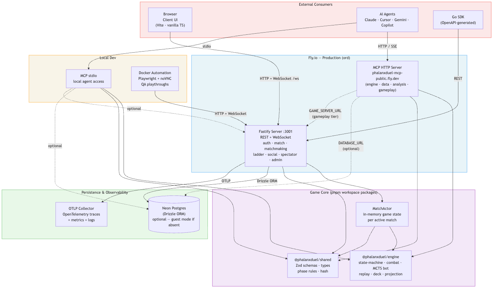

# Phalanx Duel

Arm yourself for battle with spades and clubs and shields against your opponent.

Phalanx Duel is a tactical 1v1 card combat game. This repository contains the core rules engine and the official web implementation as a TypeScript monorepo.

Phalanx Duel is also a hands-on architecture laboratory maintained by [Mike Hall](https://www.just3ws.com/), a Principal Software Engineer and Systems Architect available for hire for legacy modernization, distributed systems, platform resilience, OpenTelemetry, and AI-augmented engineering work. See the [Principal resume](https://www.just3ws.com/resumes/mike-hall-principal-software-engineer/) or [contact Mike](https://www.just3ws.com/contact/).

## 🚀 Quick Start

### 1. Prerequisites
- **Node.js 24** (via `mise`)
- **pnpm 10+** (via `corepack`)
- **Postgres 17** (local or container)

### 2. Setup
```bash
rtk pnpm install
rtk pnpm qa:setup
```

### 3. Run
```bash
rtk pnpm services start all --tmux
```
The game will be available at [http://127.0.0.1:5173](http://127.0.0.1:5173).

For detailed setup, troubleshooting, and advanced workflows, see the **[Development Guide](docs/development.md)**.
  
## ✨ Feature Highlights

- **Server-Authoritative Determinism**: Provably fair outcomes via an append-only action ledger.
- **Phalanx Damage Mechanics**: Strategic columnar damage flow and AoE suit effects (♠/♣/♦/♥).
- **Fog of War**: Real-time hidden state management and strategic face-down card deployment.
- **Truth Gate QA**: High-entropy property-based testing and automated playthrough verification.
- **OTel-Native Observability**: Integrated Grafana LGTM stack for deep production visibility.

See the full **[Features Guide](docs/reference/features.md)** for more details.

## 📖 Documentation

The **[Documentation Wiki](docs/README.md)** is the central entry point for all project knowledge.

### Key Entry Points
- **[How to Play](docs/gameplay/how-to-play.md)** — Game rules and mechanics
- **[Development Guide](docs/development.md)** — Local setup, services, and workflows
- **[Testing & QA](docs/testing.md)** — Running tests, simulations, and playthroughs
- **[Configuration](docs/configuration.md)** — Environment variables and secrets
- **[Architecture](docs/architecture/principles.md)** — System design and boundaries
- **[Contributing](CONTRIBUTING.md)** — Workflow, standards, and PR expectations

Generated QA, playthrough, and presentation captures are local evidence rather than source code and are excluded from Git. Public site media required for builds is maintained in the [site repository](https://github.com/phalanxduel/phalanxduel.github.io); large local captures may be stored on external project storage.

## 🗺️ Monorepo Map



| Package | Role |
|---|---|
| `shared/` | Data contracts, Zod schemas, and hashing |
| `engine/` | Pure deterministic rules engine (no I/O) |
| `server/` | Authoritative Fastify & WebSocket server |
| `client/` | Vite-powered Web UI |
| `sdk/` | Generated API client libraries (Go, TS) |
| `mcp/` | MCP server for AI-agent access — tiered by env var |
| `docs/` | Canonical documentation tree |
| `backlog/` | Active task management and decisions |

See **[Architecture Principles](docs/architecture/principles.md)** for design decisions and constraints.

## 💛 Support This Project

Phalanx Duel is built and run out of pocket — server hosting on [Fly.io](https://fly.io),
the database on [Neon](https://neon.tech), DNS on [DNSimple](https://dnsimple.com), email on
[Migadu](https://migadu.com), and the AI tooling (Claude, Codex, Gemini/Antigravity) used to
build and maintain it. [Stripe](https://stripe.com) handles payments and
[GoatCounter](https://goatcounter.com) handles privacy-friendly analytics. Those are the
real, verifiable line items; the exact totals move around month to month, so I'm not going
to pretend to quote a precise number — this is just what it actually costs to keep the
lights on. None of that is required reading before you play, though — the game costs
nothing and the source is open under [AGPL-3.0-or-later](LICENSE).

Think of this less as a donation ask and more as busking: I'm building this in the open
because I enjoy it, not because anyone owes me anything. If you've played a match, poked
around the engine, or just like that this exists, a coin in the case genuinely helps cover
the bills and is always appreciated — never expected.

- [GitHub Sponsors](https://github.com/sponsors/just3ws)
- [Buy Me a Coffee](https://buymeacoffee.com/just3ws)

The effort behind this is verifiable, not just claimed — every commit across this repo and
its siblings under [phalanxduel](https://github.com/phalanxduel) is public history.

## ⚖️ License

Licensed under [AGPL-3.0-or-later](LICENSE).
