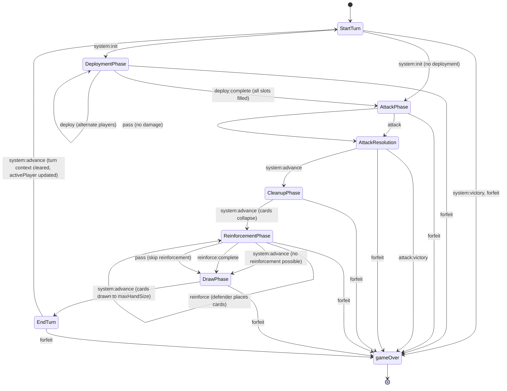
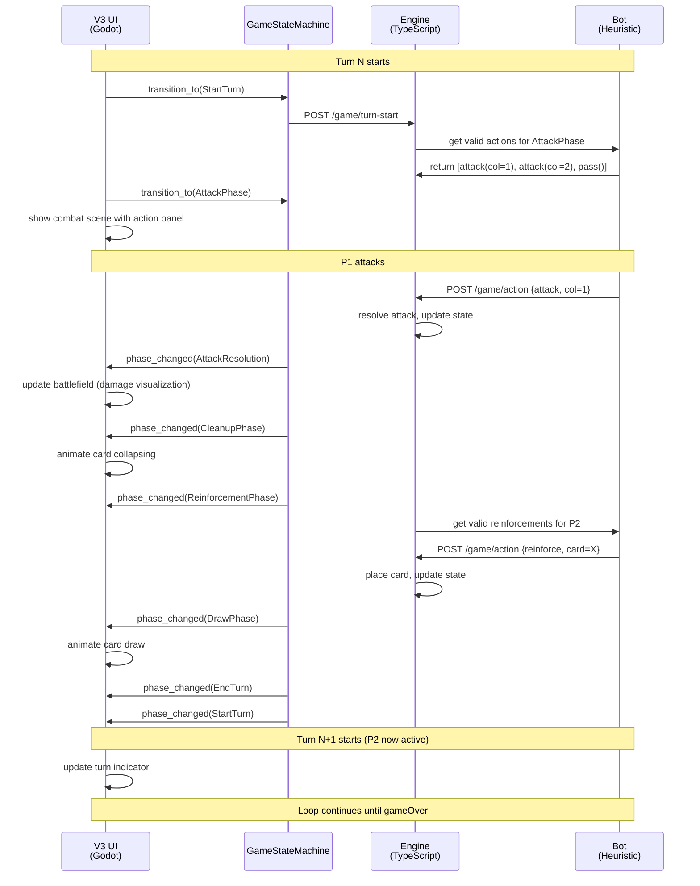
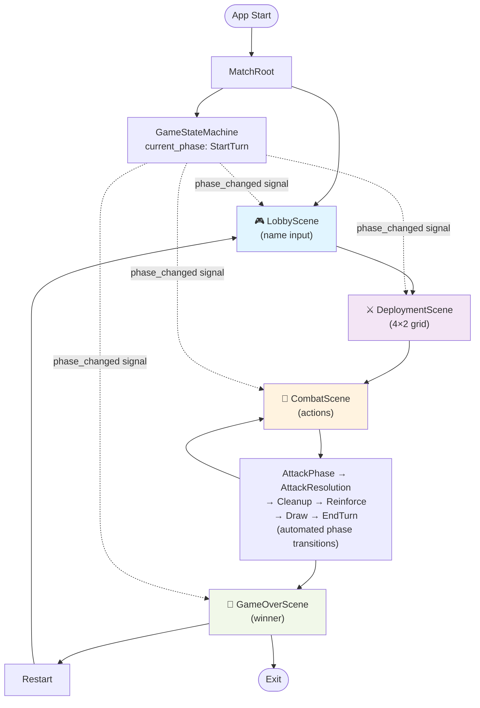
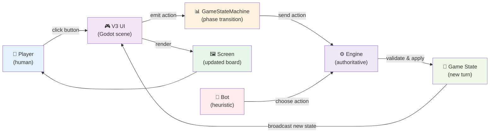

# V3 Game Flow Diagrams

> Iceboxed context: Godot/V3 migration is not active. This document is retained
> only as historical planning material and must not be used as current project
> direction unless Backlog explicitly reactivates Godot/V2/V3 work.

## 1. Game Statechart (Phase Transitions)

## 2. Turn Sequence (Automated Bot Match)

## 3. V3 Scene Lifecycle

## 4. Action Flow (Player Input → State Change)

## Key Invariants

1. **Engine is authoritative** — V3 UI sends actions, engine validates and applies
2. **Phases are sequential** — no parallel phases or out-of-order transitions
3. **Deterministic with seeded scenario** — same seed=12345 produces identical game flow
4. **Player alternation** — active player switches after each turn (EndTurn → StartTurn)
5. **Auto-advance phases** — AttackResolution, Cleanup, Draw are automatic; only AttackPhase and ReinforcementPhase await player/bot action

## Testing Against Reference

- Play seed=12345 in V3
- Compare phase transitions with `artifacts/seeded-baseline/scenario.json`
- Verify each screenshot matches V1 baseline
- Iterate until pixel-perfect parity
