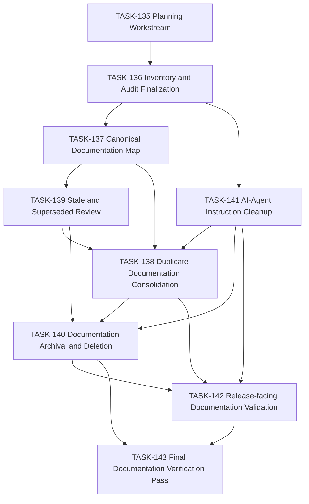

## Description

<!-- SECTION:DESCRIPTION:BEGIN -->
Drive a full pre-release documentation consolidation effort using Backlog.md as
the control surface for audit, sequencing, execution, and verification.

This work exists because the repository's documentation had accumulated across
`docs/`, `backlog/`, the since-retired root `archive/` surface, review prompts,
planning notes, research artifacts, generated docs, and agent instruction
surfaces. AI agents depend on repo documentation heavily, so duplication, stale
guidance, and ambiguous canonical sources directly reduce agent reliability and
pre-release confidence.

The repo will be moved toward:

- one authoritative location for non-essential scattered docs
- reduced duplication
- explicit archival or deletion recommendations
- clear designation of canonical docs
- alignment between docs and the current codebase and repo behavior
<!-- SECTION:DESCRIPTION:END -->

## Audit Taxonomy

- `KEEP_CANONICAL`
- `KEEP_MOVE`
- `KEEP_CONSOLIDATE`
- `MERGE_DUPLICATE`
- `STALE_REVIEW`
- `SUPERSEDED_BY_CODE`
- `SUPERSEDED_BY_DOC`
- `ARCHIVE`
- `DELETE_DEAD`
- `GENERATED_ARTIFACT`
- `AGENT_CRITICAL`
- `RELEASE_CRITICAL`

## Sequencing Strategy

1. Inventory the documentation surface and classify each document or artifact
   family without making broad destructive changes.
2. Establish the canonical documentation map and identify duplicate clusters.
3. Create execution tasks for safe consolidation, stale review, archival,
   deletion, and release-facing validation.
4. Execute only deterministic, reviewable cleanup in bounded task units.
5. End with a final verification pass that checks canonicality, release-facing
   discoverability, and AI-agent instruction consistency.

## Dependency DAG

## Deliverables

- Master audit artifact with inventory, classifications, and migration plan
- Canonical documentation map
- Delete/archive/merge/move matrix
- Structured Backlog task tree for safe execution
- Final documentation verification criteria for pre-release readiness

## Acceptance Criteria
<!-- AC:BEGIN -->
- [x] #1 A planning artifact exists that defines the objective, taxonomy, sequencing strategy, deliverables, and overall acceptance criteria for the documentation consolidation effort.
- [x] #2 A repo-wide documentation audit exists under the Backlog-managed structure and classifies the documentation surface into authoritative, duplicate, stale, superseded, archival, generated, and release-critical categories.
- [x] #3 A complete Backlog task tree exists for the cleanup effort, covering inventory, canonical map, duplicate consolidation, stale/superseded review, archival/deletion, AI-agent instruction cleanup, release-facing validation, and final verification.
- [x] #4 The audit and task tree identify exact recommended moves, merges, archival candidates, and deletion candidates without performing broad destructive cleanup in the same pass.
- [x] #5 The final verification criteria explicitly define what “documentation clean and releasable” means for both humans and AI agents.
<!-- AC:END -->

## Implementation Plan

<!-- SECTION:PLAN:BEGIN -->
1. Inspect the existing Backlog.md structure and active repo documentation
   surfaces.
2. Create this top-level workstream task as the planning/control artifact for
   the effort.
3. Produce `backlog/docs/doc-2 - Documentation Consolidation Audit.md` with:
   executive summary, inventory summary, duplicate clusters, stale/superseded
   lists, release-critical surfaces, agent-critical surfaces, canonical map,
   migration map, and risk register.
4. Create the execution task tree in Backlog with explicit dependencies and
   acceptance criteria.
5. Update high-level guidance only as needed to reflect the new active
   documentation-cleanup priority.
6. Verify markdown integrity and keep all broad cleanup actions deferred to the
   follow-up tasks created here.
<!-- SECTION:PLAN:END -->

## Implementation Notes

<!-- SECTION:NOTES:BEGIN -->
- This planning unit establishes the structure and recommendations only. It does
  not perform wide deletion or migration across the documentation corpus.
- Release-facing artifacts (`README.md`, legal docs, contributor guidance,
  changelog, API artifacts, and authoritative system docs) must remain easy to
  find even if some process/history material moves into Backlog-managed or
  archival surfaces later.
- Created `backlog/docs/doc-2 - Documentation Consolidation Audit.md` as the
  master audit artifact. It includes the executive summary, inventory summary,
  duplicate clusters, stale/superseded candidates, canonical map, migration
  map, risk register, and action matrix.
- Created the follow-up task tree (`TASK-136` through `TASK-143`) to separate
  audit finalization, canonical-map enforcement, duplicate consolidation, stale
  review, archival/deletion, AI-agent instruction cleanup, release-facing
  validation, and the final verification pass into reviewable work units.
- Chained the follow-up tasks into an explicit DAG so work can proceed from
  audit finalization to canonical mapping, then through stale review and
  duplicate consolidation, then into archival/deletion, release validation, and
  final verification with minimal backtracking.
- Updated `AGENTS.md` so the active priority reflects this documentation cleanup
  tranche instead of pointing at an already-finished review lane.
<!-- SECTION:NOTES:END -->

## Verification

- `pnpm exec markdownlint-cli2 AGENTS.md backlog/docs/ai-agent-workflow.md "backlog/docs/doc-2 - Documentation Consolidation Audit.md" "backlog/tasks/task-135 - Workstream-Pre-release-Documentation-Consolidation.md" "backlog/tasks/task-136 - Documentation-Inventory-and-Audit-Finalization.md" "backlog/tasks/task-137 - Canonical-Documentation-Map.md" "backlog/tasks/task-138 - Duplicate-Documentation-Consolidation.md" "backlog/tasks/task-139 - Stale-and-Superseded-Documentation-Review.md" "backlog/tasks/task-140 - Documentation-Archival-and-Deletion.md" "backlog/tasks/task-141 - AI-Agent-Instruction-Cleanup.md" "backlog/tasks/task-142 - Release-facing-Documentation-Validation.md" "backlog/tasks/task-143 - Final-Documentation-Verification-Pass.md" --config .markdownlint-cli2.jsonc`
