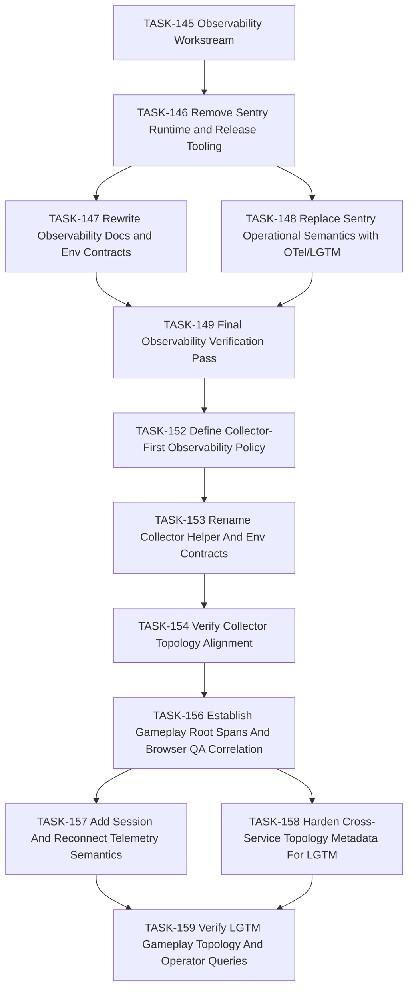

## Description

<!-- SECTION:DESCRIPTION:BEGIN -->
Drive the bounded migration from mixed Sentry/OTel language and tooling to a
fully OpenTelemetry-native observability experience backed by the local
collector and centralized LGTM stack.

## Rationale

The decision is now explicit: Sentry is deprecated. The remaining work should
be executed as a small, reviewable migration DAG so tooling, docs, runtime
assumptions, and verification all converge on the same architecture.
<!-- SECTION:DESCRIPTION:END -->

## Acceptance Criteria
<!-- AC:BEGIN -->
- [x] #1 The remaining active Sentry dependencies are captured in explicit follow-on tasks rather than left as undocumented cleanup debt.
- [x] #2 The task tree separates runtime/tooling removal, documentation/env cleanup, and final verification so the repo can migrate without ambiguity.
- [x] #3 AGENTS and the backlog reflect this observability migration as the active priority.
<!-- AC:END -->

## Implementation Plan

<!-- SECTION:PLAN:BEGIN -->
1. Record the architecture decision and this workstream task.
2. Create follow-on tasks for runtime/tooling removal, docs/env cleanup,
   operational semantics replacement, and final verification.
3. Update `AGENTS.md` so the active priority reflects the observability
   migration instead of the previous documentation tranche.
4. Leave implementation work to the child tasks so each migration slice lands
   with reviewable verification.
<!-- SECTION:PLAN:END -->

## Implementation Notes

<!-- SECTION:NOTES:BEGIN -->
- Initial active-repo sweep still finds Sentry references in root docs,
  environment documentation, release/deployment helper scripts,
  `server/package.json`, `package.json`, and runtime-facing CSP comments in
  `server/src/app.ts`.
- No active SigNoz references remain outside completed-history surfaces.
- Follow-on collector-topology clarification work is captured in `TASK-152`,
  `TASK-153`, and `TASK-154` so the observability migration records the
  collector-first architecture explicitly instead of relying on tribal
  knowledge.
- Follow-on gameplay telemetry hardening is captured in `TASK-156`,
  `TASK-157`, `TASK-158`, and `TASK-159` so the OTel milestone includes match
  root correlation, reconnect semantics, and LGTM topology validation rather
  than stopping at vendor removal alone.
- 2026-03-31: The full workstream DAG is now complete in the live backlog:
  `TASK-146`, `TASK-147`, `TASK-148`, `TASK-149`, `TASK-152`, `TASK-153`,
  `TASK-154`, `TASK-156`, `TASK-157`, `TASK-158`, and `TASK-159` are all
  `Done`.
- 2026-03-31: `AGENTS.md` was reconciled with the live backlog so the
  observability chain no longer presents stale `Human Review` states for
  `TASK-156` through `TASK-159`, and the parent `TASK-145` workstream is now
  review-ready.

## Verification

- `rg -n -i "signoz|sentry" README.md AGENTS.md .github docs/system scripts package.json server/package.json backlog/decisions`
- `pnpm exec markdownlint-cli2 AGENTS.md docs/adr/README.md "docs/adr/decision-026 - DEC-2F-001 - OTel-native observability and Sentry deprecation.md" "backlog/tasks/task-145 - Workstream-OTel-native-Observability-Migration.md" "backlog/tasks/task-146 - Remove-Sentry-Runtime-and-Release-Tooling.md" "backlog/tasks/task-147 - Rewrite-Observability-Docs-and-Env-Contracts.md" "backlog/tasks/task-148 - Replace-Sentry-Operational-Semantics-with-OTel-LGTM.md" "backlog/tasks/task-149 - Final-Observability-Verification-Pass.md" --config .markdownlint-cli2.jsonc`
- `rtk backlog task list --plain`
- `rtk pnpm exec markdownlint-cli2 AGENTS.md "backlog/tasks/task-145 - Workstream-OTel-native-Observability-Migration.md" --config .markdownlint-cli2.jsonc`
<!-- SECTION:NOTES:END -->

## Dependency DAG

