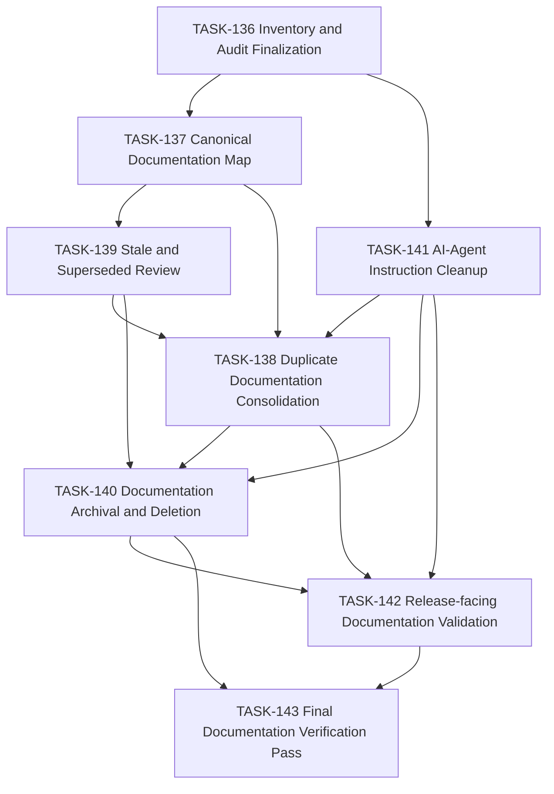

# Documentation Consolidation Audit

## Executive Summary

The repository already has strong canonical documentation anchors, but the
documentation surface is too broad for pre-release confidence. Active reference
docs, backlog process docs, review prompts, historical plans, research reports,
generated artifacts, and AI-agent instructions are spread across `docs/`,
`backlog/`, `.github/`, root markdown files, and `archive/`.

The main problem is not absence of documentation. It is structural ambiguity:

- active and historical content compete in the same broad `docs/` surface
- planning and review material remain outside Backlog-managed locations
- operational topics are represented in overlapping runbooks and deployment docs
- AI-agent guidance is mostly consolidated but still split across several entry
  points
- generated artifacts sit adjacent to hand-authored docs and need clearer
  treatment in cleanup decisions

The repo is therefore documentation-rich but not yet documentation-tight.
Pre-release cleanup should preserve authoritative and release-facing docs while
moving or retiring process/history material that should not remain in the active
reference surface.

## Scope and Taxonomy

This audit covers top-level markdown files, active docs under `docs/`, Backlog
documentation surfaces, root/archive historical material, review prompts,
research docs, planning docs, AI-agent instruction docs, and generated
documentation artifact families.

Classification labels used:

- `KEEP_CANONICAL`
- `KEEP_MOVE`
- `KEEP_CONSOLIDATE`
- `MERGE_DUPLICATE`
- `STALE_REVIEW`
- `SUPERSEDED_BY_CODE`
- `SUPERSEDED_BY_DOC`
- `ARCHIVE`
- `DELETE_DEAD`
- `GENERATED_ARTIFACT`
- `AGENT_CRITICAL`
- `RELEASE_CRITICAL`

## Inventory Summary by Category

| Category | Observed state | Primary risk | Recommended direction |
|---|---|---|---|
| Root repo docs | Lean, mostly canonical | AI guidance priority drift | Keep canonical root artifacts small and current |
| `docs/system` | Strong canonical core | Some generated/stale reports mixed into active surface | Keep core refs, quarantine generated or stale items |
| `docs/operations` + `docs/deployment` | Overlapping operational guidance | Duplicate deployment/runbook content | Consolidate toward one runbook + one deployment reference surface |
| `docs/plans` + `docs/superpowers` | Historical design/planning material in active docs tree | AI agents may treat old plans as current | Move active plans into `backlog/docs/`; archive or complete the rest |
| `docs/review` + `docs/research` | Prompt/research/history mixed with active docs | Low signal, easy stale reuse | Move active prompts into Backlog process docs; archive the rest |
| `docs/api` | Large generated artifact set | Generated content competing with hand-authored docs | Keep generated artifacts, but treat as generated and avoid using them as policy docs |
| `backlog/decisions` | Good canonical decision surface | Needs continued discipline | Keep canonical |
| `backlog/docs` | Small but active | Some remaining plans may age out | Keep as home for active process docs and active plans |
| `archive/` | Already historical | Root archive still broad and uneven | Keep historical, but tighten archival placement conventions |
| AI-agent instructions | Mostly consolidated | Several entry points can still drift | Keep one canonical root instruction + thin pointers elsewhere |

## Duplicate Clusters

1. Operations and deployment guidance
   - `docs/system/OPERATIONS_RUNBOOK.md`
   - `docs/operations/INCIDENT_RUNBOOKS.md`
   - `docs/operations/STABILITY_DEPLOYMENT_GUIDE.md`
   - `docs/deployment/DEPLOYMENT_CHECKLIST.md`
   - `docs/deployment/STAGING_SETUP_GUIDE.md`
   - `docs/deployment/STAGING_DEPLOYMENT.md`
   - `docs/deployment/FLYIO_PRODUCTION_GUIDE.md`
   - `docs/deployment/FLYIO_CONFIG_FIX.md`

2. Glossary and vocabulary guidance
   - `docs/system/GLOSSARY.md`
   - `backlog/docs/doc-1 - Phalanx Duel Glossary.md`
   - rule-linked terminology in `docs/RULE_AMENDMENTS.md`

3. Planning and implementation-design material
   - `docs/plans/*.md`
   - `docs/superpowers/plans/*.md`
   - `docs/superpowers/specs/*.md`
   - `backlog/docs/PLAN - *.md`
   - `backlog/completed/docs/PLAN - *.md`

4. AI/review/audit guidance
   - `docs/review/*.md`
   - `docs/research/*.md`
   - `archive/ai-reports/**`
   - root/archive summary files for prior execution waves

5. Rules copies and generated mirrors
   - `docs/RULES.md`
   - `docs/api/media/RULES.md`

## Stale Docs List

- `docs/plans/api-completeness-dag.md`
- `docs/plans/gameplay-scenarios.md`
- `docs/plans/2026-03-21-stability-playability-dag.md`
- `docs/superpowers/plans/*.md`
- `docs/superpowers/specs/*.md`
- `docs/review/META_ANALYSIS.md`
- `docs/research/DHI_*`
- many root `archive/*.md` execution summaries that should remain historical only

These are not automatic deletion candidates, but they should not continue to
compete with active release-facing or agent-facing docs.

## Superseded Docs List

- `backlog/docs/doc-1 - Phalanx Duel Glossary.md`
  Superseded by the canonical glossary in `docs/system/GLOSSARY.md`.
- `docs/operations/INCIDENT_RUNBOOKS.md`
  Largely superseded by `docs/system/OPERATIONS_RUNBOOK.md`.
- much of `docs/deployment/*.md`
  Likely superseded in part by `docs/system/OPERATIONS_RUNBOOK.md`,
  `docs/operations/CI_CD_PIPELINE.md`, and the actual Fly/GitHub config.
- `docs/api/media/RULES.md`
  Generated or mirrored copy that should not compete with `docs/RULES.md`.

## Stale Review Decisions In Progress

- `docs/plans/*.md`
  Treat as non-canonical planning material. If a plan is still active, move it
  into `backlog/docs/`; otherwise archive it or move it to
  `backlog/completed/docs/`.
- `docs/plans/api-completeness-dag.md`
  Move to completed-plan history. It is a milestone DAG for `TASK-113` through
  `TASK-121`, not a current canonical reference doc.
- `docs/plans/gameplay-scenarios.md`
  Move to `backlog/docs/` as active planning/spec context unless a later task
  promotes a cleaned-up scenario set into canonical `docs/`. Keep the content,
  but remove it from the active `docs/plans/` surface.
- `docs/plans/2026-03-21-stability-playability-dag.md`
  Archive. It encodes a point-in-time branch/worktree recovery plan and should
  not compete with current workflow guidance.
- `docs/superpowers/plans/*.md` and `docs/superpowers/specs/*.md`
  These read as historical implementation/design work products and should not
  remain in the active `docs/` tree. Default disposition is archive or
  completed-doc retention, not active reference status.
- `docs/superpowers/plans/*.md`
  Move to `backlog/completed/docs/` when they still explain shipped work, or to
  `archive/` when they are purely execution scaffolding for a finished burst.
- `docs/superpowers/specs/*.md`
  Retain only as completed-design history tied to the owning task/workstream.
  They should not remain discoverable as active canonical docs.
- `docs/review/HARDENING.md` and `docs/review/PRODUCTION_PATH_REVIEW_GUIDELINE.md`
  These are process prompts. If still needed operationally, they belong in
  `backlog/docs/`; otherwise they should be archived.
- `docs/review/META_ANALYSIS.md`
  Historical synthesis only. Archive.
- `docs/research/DHI_*`
  Historical research corpus. Archive.
- `docs/deployment/*.md` and `docs/operations/STABILITY_DEPLOYMENT_GUIDE.md`
  These are a consolidation cluster, not a mass-deletion cluster. Merge current
  operator truth into one canonical deployment surface plus the operations
  runbook before retiring the point-in-time docs.
- `docs/operations/INCIDENT_RUNBOOKS.md`
  Merge the remaining unique incident procedures into
  `docs/system/OPERATIONS_RUNBOOK.md`, then retire the duplicate surface.
- `backlog/docs/doc-1 - Phalanx Duel Glossary.md`
  Fully superseded by `docs/system/GLOSSARY.md`. Retire during duplicate-doc
  consolidation instead of leaving two glossary surfaces active.

## Dead Doc Candidates

These are likely safe deletion candidates, but should still be reviewed in a
dedicated execution task rather than deleted in the audit pass:

- duplicate summary/runbook material fully covered by canonical docs after
  consolidation
- obsolete deployment-fix note docs whose guidance is now encoded in current
  config and runbooks
- old root archive execution summaries if retained elsewhere in better archival
  form

## Release-critical Docs That Must Remain Easy to Find

- `README.md`
- `CHANGELOG.md`
- `.github/CONTRIBUTING.md`
- `.github/SECURITY.md`
- `.github/CODE_OF_CONDUCT.md`
- `.github/PULL_REQUEST_TEMPLATE.md`
- `docs/RULES.md`
- `docs/system/ARCHITECTURE.md`
- `docs/system/DEFINITION_OF_DONE.md`
- `docs/system/OPERATIONS_RUNBOOK.md`
- `docs/system/SECURITY_STRATEGY.md`
- `docs/system/ENVIRONMENT_VARIABLES.md`
- `docs/system/SCHEMA_EVOLUTION_STRATEGY.md`
- `docs/system/VERSIONING.md`
- `docs/legal/GOVERNANCE.md`
- `docs/legal/TRADEMARKS.md`
- `docs/api/openapi.json`
- `docs/api/asyncapi.yaml`

## AI-agent-critical Docs That Must Remain Explicit and Current

- `AGENTS.md`
- `CLAUDE.md`
- `.github/copilot-instructions.md`
- `.github/instructions/trust-boundaries.instructions.md`
- `backlog/docs/ai-agent-workflow.md`
- `backlog/decisions/README.md`
- `docs/system/ARCHIVAL_POLICY.md`
- `docs/system/AI_COLLABORATION.md`
- `docs/system/DEFINITION_OF_DONE.md`

## Proposed Canonical Documentation Map

### Root-facing repo artifacts

- `README.md`: repo entry point and local setup
- `CHANGELOG.md`: release history
- `AGENTS.md`: canonical AI-agent instructions
- `CLAUDE.md`: thin pointer only
- `.github/CONTRIBUTING.md`: contributor workflow

### Backlog-managed active governance/process docs

- `backlog/decisions/`: architecture and policy decisions
- `backlog/docs/`: active plans, workflow docs, active audits, migration maps
- `backlog/tasks/`: current execution units
- `backlog/completed/`: completed execution history
- `backlog/milestones/`: high-level roadmap units

### Canonical active reference docs

- `docs/system/`: system architecture, operations, security, contributor and
  operator references
- `docs/legal/`: governance and trademark policy
- `docs/seo/`: route indexing policy
- `docs/history/`: explicit historical narrative only
- `docs/api/`: generated/public API artifacts

### Historical / archival surfaces

- `archive/`: project-wide historical material that is no longer active
- `backlog/archive/`: retired backlog records
- `backlog/completed/docs/`: completed plan/history docs that still matter for
  execution traceability
- `archive/ai-reports/`: historical AI audit outputs

## Execution DAG

## Proposed Migration / Consolidation Map

| Current surface | Proposed canonical home | Recommendation |
|---|---|---|
| `docs/plans/*.md` | `backlog/docs/` if still active, else `backlog/completed/docs/` or `archive/` | `KEEP_MOVE` / `ARCHIVE` |
| `docs/plans/api-completeness-dag.md` | `backlog/completed/docs/` | `KEEP_MOVE` |
| `docs/plans/gameplay-scenarios.md` | `backlog/docs/` unless later promoted into canonical reference docs | `KEEP_MOVE`, `STALE_REVIEW` |
| `docs/plans/2026-03-21-stability-playability-dag.md` | `archive/` | `ARCHIVE` |
| `docs/superpowers/plans/*.md` | `backlog/completed/docs/` or `archive/` | `ARCHIVE` |
| `docs/superpowers/specs/*.md` | `backlog/completed/docs/` or `archive/` unless still driving work | `ARCHIVE` / `STALE_REVIEW` |
| `docs/review/PRODUCTION_PATH_REVIEW_GUIDELINE.md` | `backlog/docs/` if still an active prompt source | `KEEP_MOVE` / `ARCHIVE` |
| `docs/review/HARDENING.md` | `backlog/docs/` if still used, else `archive/` | `KEEP_MOVE` / `ARCHIVE` |
| `docs/review/META_ANALYSIS.md` | `archive/` | `ARCHIVE` |
| `docs/research/DHI_*` | `archive/` | `ARCHIVE` |
| `docs/operations/INCIDENT_RUNBOOKS.md` | merge into `docs/system/OPERATIONS_RUNBOOK.md` | `MERGE_DUPLICATE` |
| `docs/deployment/*.md` | reduce to one canonical deployment reference plus runbook links | `KEEP_CONSOLIDATE` / `STALE_REVIEW` |
| `backlog/docs/doc-1 - Phalanx Duel Glossary.md` | merge into `docs/system/GLOSSARY.md` and retire | `SUPERSEDED_BY_DOC` |
| `docs/api/media/RULES.md` | generated mirror only, or remove if not needed by docs generator | `GENERATED_ARTIFACT`, `MERGE_DUPLICATE` |
| root `archive/*.md` execution summaries | `archive/` subfolders by theme/date | `KEEP_CONSOLIDATE` |

## Identified Risks

- Moving too aggressively could break release-facing discoverability.
- AI-agent instruction cleanup can easily create contradictory rules if not done
  from the canonical source outward.
- Generated docs may appear “duplicate” but still be needed for publishing.
- Some plans/specs may still be active implementation context despite living in
  stale-looking directories.
- Operations/deployment guidance overlaps current config and workflow, so
  consolidation must cross-check code, Fly config, and CI rather than treating
  the longest doc as authoritative.

## Inventory

This inventory is by document or inseparable artifact family. Generated artifact
families are grouped where enumerating every generated file would not improve
review quality.

| Path | Purpose | Audience | Status | Canonical | Last apparent relevance | Relationship to current code | Labels | Recommended action |
|---|---|---|---|---|---|---|---|---|
| `README.md` | Repo entry point, setup, runtime overview | contributors, users, agents | active | yes | current | aligned but OTEL section needs later consolidation review | `KEEP_CANONICAL`, `RELEASE_CRITICAL` | keep at root |
| `CHANGELOG.md` | release history | contributors, release managers | active | yes | current | repo-facing artifact | `KEEP_CANONICAL`, `RELEASE_CRITICAL` | keep at root |
| `AGENTS.md` | canonical AI-agent instructions | agents | active | yes | current | authoritative for workflow pointers and RTK rule | `KEEP_CANONICAL`, `AGENT_CRITICAL`, `RELEASE_CRITICAL` | keep canonical |
| `CLAUDE.md` | thin Claude pointer to AGENTS | agents | active | yes | current | intentionally minimal | `KEEP_CANONICAL`, `AGENT_CRITICAL` | keep minimal |
| `.github/copilot-instructions.md` | GitHub Copilot pointer guidance | agents | active | secondary | current | aligned as pointer layer | `KEEP_CANONICAL`, `AGENT_CRITICAL` | keep thin and synced |
| `.github/instructions/trust-boundaries.instructions.md` | scoped trust-boundary guidance | agents | active | scoped | current | useful for gameplay/security surfaces | `KEEP_CANONICAL`, `AGENT_CRITICAL` | keep scoped |
| `.github/CONTRIBUTING.md` | contributor setup and validation | contributors | active | yes | current | release-facing onboarding doc | `KEEP_CANONICAL`, `RELEASE_CRITICAL` | keep canonical |
| `.github/SECURITY.md` | security contact/reporting entry point | contributors, reporters | active | yes | current | standard repo-facing security artifact | `KEEP_CANONICAL`, `RELEASE_CRITICAL` | keep canonical at `.github/` |
| `.github/CODE_OF_CONDUCT.md` | community conduct policy | contributors | active | yes | current | standard repo-facing governance artifact | `KEEP_CANONICAL`, `RELEASE_CRITICAL` | keep canonical at `.github/` |
| `.github/PULL_REQUEST_TEMPLATE.md` | PR author checklist and structure | contributors | active | yes | current | standard repo-facing workflow artifact | `KEEP_CANONICAL`, `RELEASE_CRITICAL` | keep canonical at `.github/` |
| `docs/README.md` | docs wiki index | contributors, agents | active | yes | current | good canonical navigation layer | `KEEP_CANONICAL`, `RELEASE_CRITICAL` | keep canonical |
| `docs/system/README.md` | system-doc index | contributors, agents | active | yes | current | aligned | `KEEP_CANONICAL` | keep canonical |
| `docs/system/DEVELOPER_GUIDE.md` | scenario-oriented contributor how-to and FAQ guide | contributors, agents | active | yes | current | new canonical entry point for developer workflows | `KEEP_CANONICAL`, `RELEASE_CRITICAL` | keep canonical |
| `docs/RULES.md` | normative gameplay rules | contributors, agents, reviewers | active | yes | current | authoritative by decision record | `KEEP_CANONICAL`, `RELEASE_CRITICAL`, `AGENT_CRITICAL` | keep canonical |
| `docs/RULE_AMENDMENTS.md` | errata and clarifications to rules | contributors, agents | active | likely | 2026-03 | linked to glossary/rules, still meaningful | `KEEP_CANONICAL` | keep, review for merge pressure later |
| `docs/system/ARCHITECTURE.md` | descriptive system design | contributors, agents | active | yes | current | core canonical ref | `KEEP_CANONICAL`, `RELEASE_CRITICAL` | keep canonical |
| `docs/system/DEFINITION_OF_DONE.md` + `docs/system/dod/*` | completion criteria | contributors, agents | active | yes | current | active workflow reference | `KEEP_CANONICAL`, `AGENT_CRITICAL` | keep canonical |
| `docs/system/AI_COLLABORATION.md` | AI collaboration policy | contributors, agents | active | yes | current | complements AGENTS without replacing it | `KEEP_CANONICAL`, `AGENT_CRITICAL` | keep canonical |
| `docs/system/ARCHIVAL_POLICY.md` | archival policy | contributors, agents | active | yes | current | directly relevant to cleanup work | `KEEP_CANONICAL`, `AGENT_CRITICAL` | keep canonical |
| `docs/system/OPERATIONS_RUNBOOK.md` | canonical operations guide | operators, contributors | active | yes | current | should anchor ops consolidation | `KEEP_CANONICAL`, `RELEASE_CRITICAL` | keep canonical |
| `docs/operations/CI_CD_PIPELINE.md` | CI/CD workflow explainer | operators, contributors | active | likely | current | still looks like a canonical operational reference rather than a stale plan | `KEEP_CANONICAL`, `RELEASE_CRITICAL` | keep, verify against live workflows during consolidation |
| `docs/operations/INCIDENT_RUNBOOKS.md` | older incident-specific runbook | operators | partially stale | no | earlier hardening wave | overlaps runbook heavily | `MERGE_DUPLICATE`, `STALE_REVIEW` | merge or archive |
| `docs/operations/STABILITY_DEPLOYMENT_GUIDE.md` | staging/prod deployment procedure | operators | partially stale | partial | hardening phase | overlaps ops/deployment docs and may drift from current infra | `KEEP_CONSOLIDATE`, `STALE_REVIEW`, `RELEASE_CRITICAL` | consolidate into canonical runbook/deploy docs |
| `docs/operations/CI_CD_PIPELINE.md` | CI/CD pipeline explainer | operators, contributors | active | likely | current | likely still canonical | `KEEP_CANONICAL`, `RELEASE_CRITICAL` | keep, verify against workflows later |
| `docs/deployment/DEPLOYMENT_CHECKLIST.md` | deployment checklist | operators | active | partial | hardening phase | useful but overlaps runbook/stability guide | `KEEP_CONSOLIDATE`, `RELEASE_CRITICAL` | consolidate to one deployment surface |
| `docs/deployment/STAGING_SETUP_GUIDE.md` | staging setup | operators | stale-ish | no | hardening phase | likely partially superseded by current Fly/GHA setup | `STALE_REVIEW`, `KEEP_CONSOLIDATE` | review and merge/archive |
| `docs/deployment/STAGING_DEPLOYMENT.md` | staging deploy notes | operators | stale-ish | no | hardening phase | overlaps guide/checklist | `MERGE_DUPLICATE`, `STALE_REVIEW` | merge/archive |
| `docs/deployment/FLYIO_PRODUCTION_GUIDE.md` | Fly production guide | operators | partial | no | hardening phase | overlaps runbook and live fly config | `KEEP_CONSOLIDATE`, `STALE_REVIEW` | merge/reduce |
| `docs/deployment/FLYIO_CONFIG_FIX.md` | one-off config fix note | operators | historical | no | point fix | likely superseded by current config | `SUPERSEDED_BY_CODE`, `ARCHIVE` | archive |
| `docs/system/ENVIRONMENT_VARIABLES.md` | env reference | contributors, operators | active | yes | current | core canonical ref | `KEEP_CANONICAL`, `RELEASE_CRITICAL` | keep canonical |
| `docs/system/SECRETS_AND_ENV.md` | secrets/env guidance | contributors, operators | active | yes | current | related to env reference | `KEEP_CANONICAL` | keep canonical |
| `docs/system/FEATURE_FLAGS.md` | flags/admin guidance | contributors, operators | active | yes | current | active canonical ref | `KEEP_CANONICAL` | keep canonical |
| `docs/system/GITHUB_AUTOMATION.md` | automation reference | contributors | active | yes | current | active reference | `KEEP_CANONICAL` | keep canonical |
| `docs/system/PERFORMANCE_SLOS.md` | SLOs | contributors, operators | active | yes | current | active policy reference | `KEEP_CANONICAL` | keep canonical |
| `docs/system/SECURITY_STRATEGY.md` | threat model | contributors, reviewers | active | yes | current | active canonical ref | `KEEP_CANONICAL`, `RELEASE_CRITICAL` | keep canonical |
| `docs/system/SECURITY_RESOURCES.md` | security references | contributors | active | yes | current | supporting canonical ref | `KEEP_CANONICAL` | keep canonical |
| `docs/system/SCHEMA_EVOLUTION_STRATEGY.md` | migration/contract policy | contributors | active | yes | current | active canonical ref | `KEEP_CANONICAL`, `RELEASE_CRITICAL` | keep canonical |
| `docs/system/VERSIONING.md` | version semantics | contributors, API consumers | active | yes | current | active canonical ref | `KEEP_CANONICAL`, `RELEASE_CRITICAL` | keep canonical |
| `docs/system/TYPE_OWNERSHIP.md` | type ownership rules | contributors, agents | active | yes | current | active canonical ref | `KEEP_CANONICAL` | keep canonical |
| `docs/system/PNPM_SCRIPTS.md` | command decision guide | contributors, agents | active | yes | current | active canonical ref | `KEEP_CANONICAL` | keep canonical |
| `docs/system/GLOSSARY.md` | canonical glossary | contributors, agents | active | yes | current | best glossary surface | `KEEP_CANONICAL`, `AGENT_CRITICAL` | keep canonical |
| `backlog/docs/doc-1 - Phalanx Duel Glossary.md` | duplicate glossary | agents, contributors | stale duplicate | no | older hardening wave | superseded by system glossary | `SUPERSEDED_BY_DOC`, `MERGE_DUPLICATE` | retire after merge review |
| `docs/system/EXTERNAL_REFERENCES.md` | external references | contributors | active | likely | current | still useful | `KEEP_CANONICAL` | keep |
| `docs/system/RULE_CHANGE_PROCESS.md` | rules governance | contributors | active | yes | current | active process ref | `KEEP_CANONICAL` | keep |
| `docs/system/DURABLE_AUDIT_TRAIL.md` | ledger/recovery architecture | contributors, operators | active | yes | current | active canonical ref | `KEEP_CANONICAL` | keep |
| `docs/system/SITE_FLOW.md` + `site-flow-*` source/artifacts | route/system flow | contributors | active | yes | current | canonical if kept together | `KEEP_CANONICAL` | keep, treat generated assets separately |
| `docs/system/ADMIN.md` | admin surface doc | contributors, operators | active | yes | current | likely canonical | `KEEP_CANONICAL` | keep |
| `docs/system/RISKS.md` | risk register | contributors | active | partial | current-ish | useful but may need ownership review | `KEEP_CANONICAL` | keep, validate later |
| `docs/system/MATCH-DB-VERIFICATION.md` | SQL verification reference for match persistence integrity | contributors, operators | narrow active reference | partial | recent enough to still map to persisted match structures | useful specialist reference, not obvious dead content | `KEEP_CANONICAL`, `STALE_REVIEW` | keep for now, reassess during ops/doc consolidation |
| `docs/system/KNIP_REPORT.md` | generated report | contributors | generated | no | current if refreshed | generated artifact | `GENERATED_ARTIFACT` | keep generated, exclude from policy authority |
| `docs/system/dependency-graph.svg` | generated diagram | contributors | generated | no | current if refreshed | generated artifact | `GENERATED_ARTIFACT` | keep generated |
| `docs/system/DEPENDENCY_VULNERABILITY_REPORT.md` | dependency vulnerability report | contributors | report-style and likely stale | no | earlier audit/report wave | reads more like retained analysis than canonical policy | `GENERATED_ARTIFACT`, `STALE_REVIEW`, `ARCHIVE` | review for archive unless still part of an active doc artifact pipeline |
| `docs/legal/GOVERNANCE.md` | governance/legal | contributors | active | yes | current | release-facing | `KEEP_CANONICAL`, `RELEASE_CRITICAL` | keep canonical |
| `docs/legal/TRADEMARKS.md` | trademark/legal | contributors | active | yes | current | release-facing | `KEEP_CANONICAL`, `RELEASE_CRITICAL` | keep canonical |
| `docs/seo/ROBOTS_ROUTE_SITEMAP.md` | SEO route policy | contributors | active | yes | current | canonical niche ref | `KEEP_CANONICAL` | keep canonical |
| `docs/history/RETROSPECTIVES.md` | explicit historical notes | contributors | historical by design | yes | historical | correctly scoped to history | `KEEP_CANONICAL`, `ARCHIVE` | keep in history |
| `docs/plans/*.md` | active-looking planning docs in docs tree | contributors, agents | mixed/stale | no | 2026-03 | planning docs should be Backlog-managed | `KEEP_MOVE`, `STALE_REVIEW` | move active items to Backlog or archive |
| `docs/plans/api-completeness-dag.md` | API completeness DAG for decoupling milestone | contributors, agents | historical planning | no | task wave still represented in backlog | replaced by task graph and decisions, useful only as completed-plan history | `KEEP_MOVE`, `STALE_REVIEW` | move to completed docs |
| `docs/plans/gameplay-scenarios.md` | scenario set for API completeness milestone | contributors, agents | useful but not canonical | no | still relevant as planning/test context | should survive, but under Backlog-managed plan/spec surfaces instead of `docs/` | `KEEP_MOVE`, `STALE_REVIEW` | move to `backlog/docs/` unless later promoted |
| `docs/plans/2026-03-21-stability-playability-dag.md` | stability/playability recovery DAG | contributors | historical plan | no | tied to branch/worktree recovery state | point-in-time plan, superseded by current backlog and mainline state | `ARCHIVE`, `SUPERSEDED_BY_DOC` | archive |
| `docs/superpowers/plans/*.md` | implementation plans | contributors, agents | stale/historical | no | 2026-03 work burst | should not remain in active docs tree | `ARCHIVE`, `STALE_REVIEW` | move to completed/archive |
| `docs/superpowers/specs/*.md` | design specs | contributors | historical unless still active | no | 2026-03 | likely plan/spec history | `STALE_REVIEW`, `ARCHIVE` | review then archive or move |
| `docs/review/PRODUCTION_PATH_REVIEW_GUIDELINE.md` | active review prompt | contributors, agents | active process doc | no | current-ish | better suited to Backlog-managed process docs | `KEEP_MOVE`, `AGENT_CRITICAL` | move to `backlog/docs/` if still active |
| `docs/review/HARDENING.md` | review prompt / audit rubric | contributors, agents | active-ish but process-oriented | no | hardening wave | better suited to Backlog-managed process docs | `KEEP_MOVE`, `AGENT_CRITICAL` | move or archive depending on use |
| `docs/review/META_ANALYSIS.md` | review synthesis | contributors | historical analysis | no | 2026-03 | not canonical for current behavior | `ARCHIVE` | archive |
| `docs/research/DHI_*` | research/evaluation corpus | decision makers | historical research | no | 2026-03 | useful history, not active reference | `ARCHIVE` | archive |
| `docs/api/openapi.json` | public API contract artifact | consumers, contributors | generated/active | yes | current if regenerated | release-facing artifact | `GENERATED_ARTIFACT`, `RELEASE_CRITICAL` | keep generated |
| `docs/api/asyncapi.yaml` | WebSocket/API contract artifact | consumers, contributors | generated/active | yes | current if regenerated | release-facing artifact | `GENERATED_ARTIFACT`, `RELEASE_CRITICAL` | keep generated |
| `docs/api/**` HTML/CSS/JS reference set | generated technical reference | contributors | generated | no | current if regenerated | useful but not policy authority | `GENERATED_ARTIFACT` | keep generated, not canonical policy |
| `docs/api/media/RULES.md` | mirrored rules copy inside generated API docs | contributors | duplicate generated mirror | no | generated | conflicts with canonical rules if treated as source | `GENERATED_ARTIFACT`, `MERGE_DUPLICATE` | keep only as generated mirror or suppress from authority |
| `backlog/decisions/*.md` | active decision records | contributors, agents | active | yes | current | canonical decision surface | `KEEP_CANONICAL`, `AGENT_CRITICAL` | keep canonical |
| `backlog/decisions/README.md` | decision index | contributors, agents | active | yes | current | canonical decision navigation | `KEEP_CANONICAL`, `AGENT_CRITICAL` | keep canonical |
| `backlog/docs/ai-agent-workflow.md` | backlog workflow | contributors, agents | active | yes | current | canonical workflow | `KEEP_CANONICAL`, `AGENT_CRITICAL` | keep canonical |
| `backlog/docs/PLAN - *.md` | active backlog plans | contributors, agents | active/mixed | yes if active | current | correct home for active plans | `KEEP_CANONICAL` | keep active, review for completion aging |
| `backlog/completed/docs/PLAN - *.md` | completed plans | contributors, agents | historical/completed | yes in completed surface | 2026-03 | correct completed context | `KEEP_CANONICAL`, `ARCHIVE` | keep in completed docs |
| `backlog/milestones/*.md` | roadmap milestones | contributors | active | yes | current | canonical milestone surface | `KEEP_CANONICAL` | keep canonical |
| `archive/*.md` root summaries | historical execution notes | contributors | historical | no | past waves | useful but broad and uneven | `ARCHIVE`, `KEEP_CONSOLIDATE` | retain historically, consider thematic subfolders |
| `archive/ai-reports/**` | AI-generated audits | contributors | historical | no | dated | explicit archive, low active value | `ARCHIVE` | keep archived only |

## Safe Deletions vs Review-gated Changes

### Safe deletions after execution-task verification

- clearly duplicate summary docs that fully mirror canonical docs
- obsolete fix-note docs already superseded by code and runbooks

### Likely deletions needing human review

- overlapping deployment docs where some unique operator detail may remain
- duplicate glossary/doc surfaces
- generated mirrors that may still be used by the doc toolchain

### Content that should be merged

- incident/deployment guidance into one canonical runbook + deployment surface
- duplicate glossary material into `docs/system/GLOSSARY.md`

### Content that should be relocated into Backlog-managed structure

- active review prompts
- active plans still living under `docs/plans/` or `docs/superpowers/`
- process-oriented documentation that is not a release-facing reference doc

### Content that should stay outside Backlog

- `README.md`, `CHANGELOG.md`, `LICENSE`, legal docs, contributor onboarding,
  canonical system references, and public/generated API artifacts
