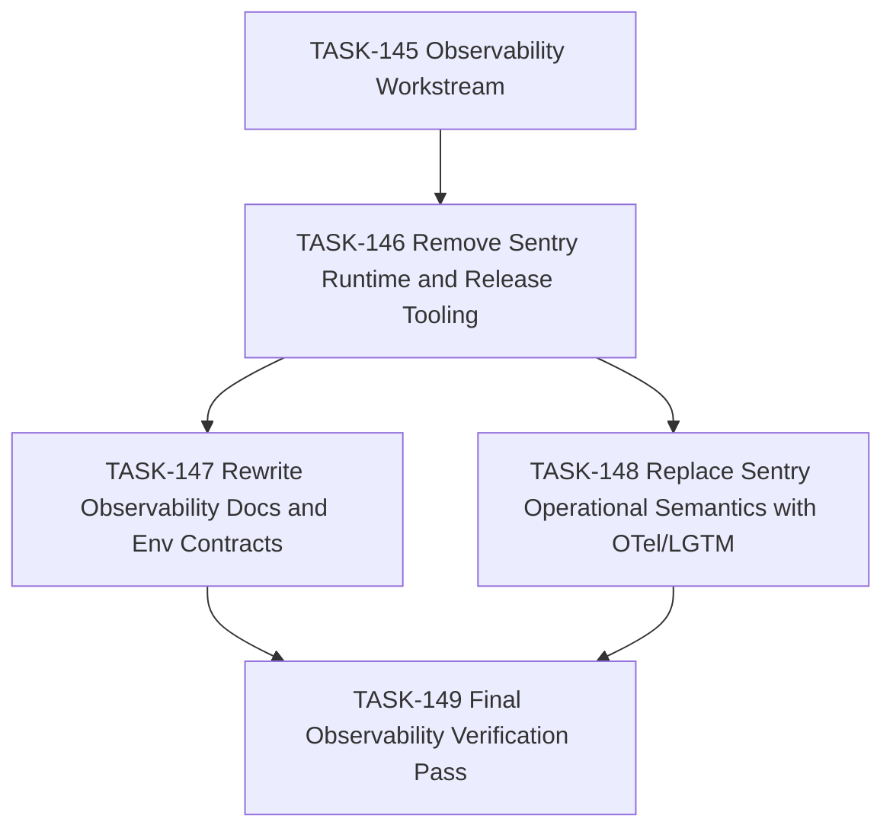

## Description

Drive the bounded migration from mixed Sentry/OTel language and tooling to a
fully OpenTelemetry-native observability experience backed by the local
collector and centralized LGTM stack.

## Rationale

The decision is now explicit: Sentry is deprecated. The remaining work should
be executed as a small, reviewable migration DAG so tooling, docs, runtime
assumptions, and verification all converge on the same architecture.

## Acceptance Criteria
<!-- AC:BEGIN -->
- [ ] #1 The remaining active Sentry dependencies are captured in explicit follow-on tasks rather than left as undocumented cleanup debt.
- [ ] #2 The task tree separates runtime/tooling removal, documentation/env cleanup, and final verification so the repo can migrate without ambiguity.
- [ ] #3 AGENTS and the backlog reflect this observability migration as the active priority.
<!-- AC:END -->

## Dependency DAG

## Implementation Plan

1. Record the architecture decision and this workstream task.
2. Create follow-on tasks for runtime/tooling removal, docs/env cleanup,
   operational semantics replacement, and final verification.
3. Update `AGENTS.md` so the active priority reflects the observability
   migration instead of the previous documentation tranche.
4. Leave implementation work to the child tasks so each migration slice lands
   with reviewable verification.

## Implementation Notes

- Initial active-repo sweep still finds Sentry references in root docs,
  environment documentation, release/deployment helper scripts,
  `server/package.json`, `package.json`, and runtime-facing CSP comments in
  `server/src/app.ts`.
- No active SigNoz references remain outside archive/completed-history
  surfaces.

## Verification

- `rg -n -i "signoz|sentry" README.md AGENTS.md .github docs/system scripts package.json server/package.json backlog/decisions`
- `pnpm exec markdownlint-cli2 AGENTS.md backlog/decisions/README.md "backlog/decisions/decision-026 - DEC-2F-001 - OTel-native observability and Sentry deprecation.md" "backlog/tasks/task-145 - Workstream-OTel-native-Observability-Migration.md" "backlog/tasks/task-146 - Remove-Sentry-Runtime-and-Release-Tooling.md" "backlog/tasks/task-147 - Rewrite-Observability-Docs-and-Env-Contracts.md" "backlog/tasks/task-148 - Replace-Sentry-Operational-Semantics-with-OTel-LGTM.md" "backlog/tasks/task-149 - Final-Observability-Verification-Pass.md" --config .markdownlint-cli2.jsonc`
