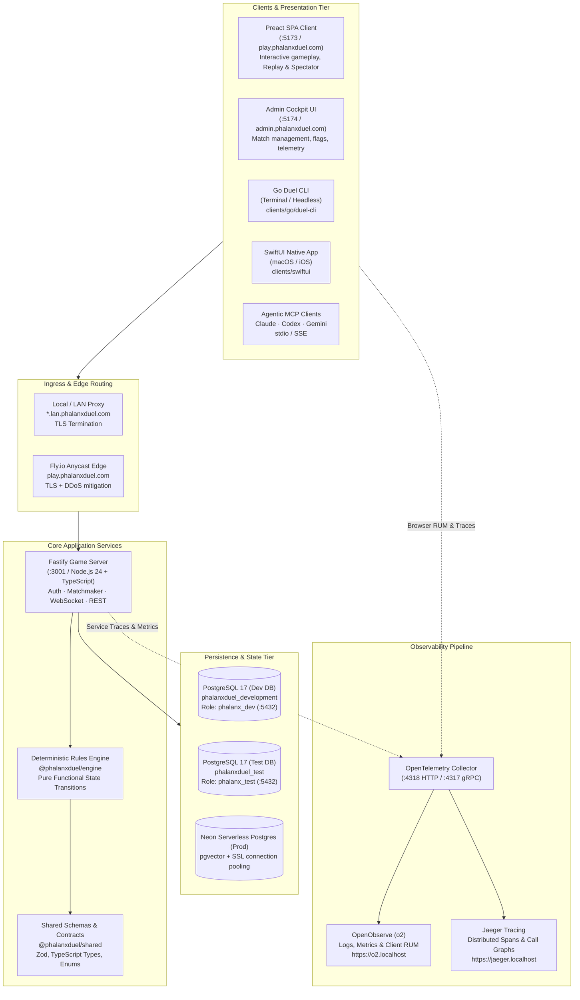
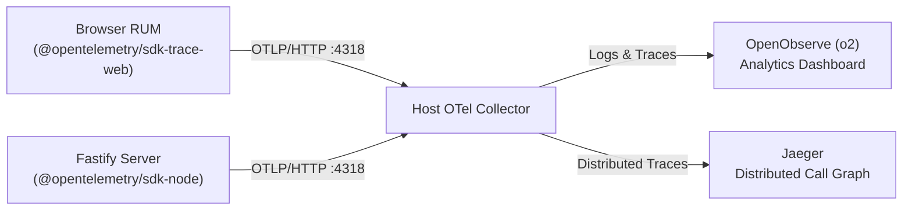

# Phalanx Duel — Full Stack Architecture & Operational Blueprint

> **Status**: Active & Canonical  
> **Audience**: Developers, Operators, Tournament Directors, AI Agents  
> **Related**:
> - [docs/system/INFRASTRUCTURE.md](../system/INFRASTRUCTURE.md) — Deployment & cloud infrastructure
> - [docs/system/TECHNOLOGY_AND_OBSERVABILITY_CATALOG.md](../system/TECHNOLOGY_AND_OBSERVABILITY_CATALOG.md) — Telemetry schema & catalog
> - [docs/ops/TOURNAMENT_RUNBOOK.md](../ops/TOURNAMENT_RUNBOOK.md) — Tournament hosting & operational runbook
> - [docs/architecture/site-flow.md](./site-flow.md) — User journey & route mapping

---

## 1. System Topology Overview

Phalanx Duel is a server-authoritative, deterministic card duel game with hybrid real-time WebSocket and REST gameplay interfaces, cross-platform client support (Web SPA, Go CLI, SwiftUI native, and Model Context Protocol for AI agents), and an OpenTelemetry-native observability pipeline.



---

## 2. Port & Service Matrix

| Service | Environment | Port | Protocol | Purpose / Access |
|---|---|---|---|---|
| **Fastify Game Server** | Local Dev / Docker | `3001` | HTTP / WS | REST API (`/api/*`), WebSocket (`/ws`), Health (`/health`) |
| **Web Client SPA** | Local Dev | `5173` | HTTP (Vite) | Preact web frontend (`http://localhost:5173`) |
| **Admin Cockpit UI** | Local Dev | `5174` | HTTP (Vite) | Match oversight and interventions (`http://localhost:5174`) |
| **Docs Library SPA** | Local Dev | `3333` | HTTP | Unified docset, ADRs, diagrams (`bin/phx-docs-library`) |
| **PostgreSQL Dev** | Host Native | `5432` | PostgreSQL Wire | `phalanxduel_development` (role: `phalanx_dev`) |
| **PostgreSQL Test** | Host Native | `5432` | PostgreSQL Wire | `phalanxduel_test` (role: `phalanx_test`) |
| **OTel Collector** | Host Native / Container | `4318` | HTTP (OTLP) | OpenTelemetry HTTP receiver for spans/logs/metrics |
| **OTel Collector** | Host Native / Container | `4317` | gRPC (OTLP) | OpenTelemetry gRPC receiver |
| **OpenObserve (o2)** | Host Service | `5080` | HTTPS (Reverse proxy) | Longitudinal analytics & RUM dashboard (`https://o2.localhost`) |
| **Jaeger UI** | Host Service | `16686` | HTTPS (Reverse proxy) | Distributed tracing graph (`https://jaeger.localhost`) |

---

## 3. Core Architectural Subsystems

### 3.1 Deterministic Rules Engine (`packages/engine`)
- **Zero I/O, Zero Side Effects**: The engine is a pure state machine: `(State, Action) -> (NewState, Events, TurnHash)`.
- **Replay Determinism**: Every turn computes a canonical SHA-256 hash (`turnHash`) binding turn number, action payload, and post-action state. This enables offline auditability and tamper-evident replays.
- **Card Combat Resolution**: Handles simultaneous resolution, damage calculation, lane defenses, and shield mechanics.

### 3.2 Authoritative Game Server (`server/`)
- **Framework**: Fastify 5 with TypeScript, compiled via `tsx` or `tsup`.
- **Match Lifecycle**:
  - **Lobby Phase**: Match creation, public matchmaking, guest alias generation, join invitations.
  - **Active Combat Phase**: Real-time action broadcast via WebSocket (`/ws`), with fallback to REST (`POST /api/matches/:id/action`).
  - **Historical Rewatch / Replay**: Complete post-game step scrubbers via `/api/matches/:id/actions` and `/api/matches/:id/replay?step=N`.
  - **Live Spectator Streams**: Low-latency observation with player-identity protection and state masking.
- **Validation**: Schema-level request/response validation using Zod and fast-json-stringify for ultra-high throughput.

### 3.3 Database Environment Isolation
Phalanx Duel strictly forbids using unisolated ambient databases. Database roles and connections are strictly partitioned:
- **Development**: Managed via `bin/maint/with-dev-postgres.sh` connecting to `phalanxduel_development` as `phalanx_dev`.
- **Automated Tests / CI**: Managed via `bin/maint/with-test-postgres.sh` connecting to `phalanxduel_test` as `phalanx_test`.
- **Tooling / Demos**: Managed via `bin/maint/with-tooling-postgres.sh`.
- **Verification**: `pnpm verify:db:isolation` enforces 20 architectural invariants to prevent accidental cross-contamination.

### 3.4 Client Ecosystem
- **Browser SPA (`client/`)**: Built on Preact 10.29 + Vite + Tailwind CSS. Features dynamic sound effects (Web Audio API), tactical board overlays, live combat animations, a spectator lobby, and a turn scrubber for historical rewatches.
- **Go Duel CLI (`clients/go/duel-cli/`)**: High-performance command-line client supporting interactive sparring, automated bot runs, connection reconnects, and message ACK replay.
- **SwiftUI Native (`clients/swiftui/`)**: Native macOS/iOS client utilizing async/await WebSocket networking and native Apple OS controls.
- **Model Context Protocol (`packages/mcp-server/`)**: Standardized AI agent interface exposing match analysis, bot recommendations, valid action queries, and autonomous sparring.

---

## 4. Communication Protocols & Data Flow

### 4.1 Real-Time WebSocket Channel (`/ws`)
Used for in-match active duels and real-time spectator feeds:
```text
Client                          Server
  │                               │
  ├────── connect (/ws) ─────────►│
  ├────── authenticate ──────────►│
  │◄───── auth_ack ───────────────┤
  │                               │
  ├────── joinMatch ─────────────►│
  │◄───── match_state (full) ─────┤
  │                               │
  ├────── action (e.g. DEPLOY) ──►│
  │◄───── action_ack ─────────────┤
  │◄───── turn_update (broadcast)─┤  (Sent to active players & spectators)
  │                               │
```

### 4.2 REST Matchmaking & Replay API
- `POST /api/matches`: Initialize a match (configure mode, life points, AI bot tier).
- `GET /api/matches/lobby`: Query active, joinable matches.
- `POST /api/matches/:id/join`: Join an existing open match slot.
- `GET /api/matches/history`: Retrieve completed historical matches.
- `GET /api/matches/:id/actions`: Fetch unredacted historical action logs for full replay reconstruction.
- `GET /api/matches/:id/replay?step=N`: Request server-reconstructed game state at an exact turn index.
- `POST /api/matches/:id/action`: REST gameplay action submission (supports degraded connectivity when WebSockets fail).

---

## 5. Observability & Telemetry Pipeline



- **Trace Correlation**: Browser client generates root spans (`browser.turn_action`, `rum.view`) propagated across HTTP/WS headers to backend spans (`fastify.request`, `match.process_action`, `pg.query`).
- **Telemetry Endpoints**:
  - OpenObserve: `https://o2.localhost` (RUM sessions, error logs, transaction analytics).
  - Jaeger: `https://jaeger.localhost` (Span latency, DAG execution breakdown).
- **Runtime CLI Monitors**:
  - `bin/phx-top` (`pnpm top`): Live terminal monitor tracking active matches, player counts, memory, and database connections.
  - `bin/phx-tournament-top`: Network bandwidth, socket concurrency, and Wi-Fi latency for tournament directors.

---

## 6. Operational Tooling & Maintenance CLI

All operations scripts are consolidated under the canonical `phx-*` namespace in `bin/`:

| Command | Purpose |
|---|---|
| `bin/phx-top` (`pnpm top`) | Real-time terminal system monitor (health, matches, DB, memory). |
| `bin/phx-demo-ctl` | Automated demo controller (start, stop, status, verify). |
| `bin/phx-tournament-check` | Comprehensive pre-flight LAN, DNS, port, and firewall audit. |
| `bin/phx-tournament-top` | Tournament bandwidth, socket, and network monitor. |
| `bin/phx-docs-library` | Unified architecture, ADR, and documentation server (:3333). |
| `bin/phx-fix` | Codebase formatter, linter, and hygiene tool (Prettier, ESLint). |
| `bin/phx-swiftbar` | macOS menu bar status integration (`phalanxduel-pulse`). |
| `bin/phx-gource` | Cinematic git visualization of repository evolution. |

---

## 7. Verification & Quality Gates

Before any commit or release, the following gates must be validated:
1. **Quick Verification**: `pnpm verify:quick` (Biome / ESLint / Typecheck / Core Tests).
2. **Database Isolation**: `pnpm verify:db:isolation` (Structural guardrails for database roles).
3. **Playability Gate**: `pnpm qa:playthrough:verify` (Automated end-to-end browser playthrough test).
4. **Full Suite**: `pnpm check` (Build -> Lint -> Typecheck -> Test across monorepo).
