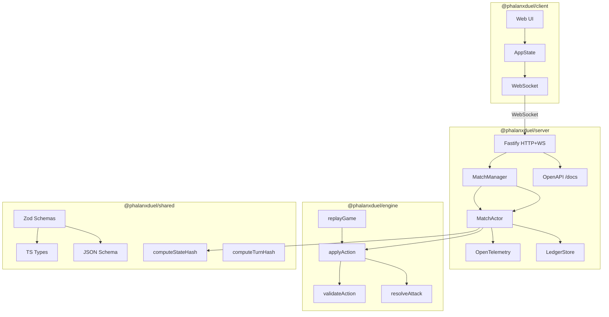

# Architecture

## Core Principle

Server-authoritative. Clients send intents; the server validates via the engine and broadcasts resulting state. Clients trust nothing — no game logic runs client-side.



## Dependency Direction

```text
shared ← engine ← server
shared ← client
```

`engine` and `client` have no dependency on each other. The engine has no server knowledge. Boundaries are enforced by dependency-cruiser (`docs/system/dependency-graph.svg`).

## Supported Client Surfaces

The browser app in `client/` remains the canonical first-party implementation.
The Go duel CLI in `clients/go/duel-cli/` is also part of the supported
reference architecture. Generated SDKs under `sdk/` are contract artifacts for
REST and typed WebSocket messages, not full runtime transports.

Use [`docs/reference/client-compatibility.md`](docs/reference/client-compatibility.md) for the
current support matrix across browser, Go, and generated SDK consumers.

## Canonical Sequence Views

The rendered SVGs under `docs/system/` are the canonical sequence views used by
the Dash docset and contributor docs:

- `gameplay-sequence-1.svg` — client intent to server validation, engine apply,
  shared contract work, and broadcast.
- `observability-sequence-1.svg` — collector-first telemetry flow from browser
  and server runtimes to the centralized LGTM path.

## Why Deterministic

All game state derives from an ordered sequence of inputs. v1.0 mandates strict replay guarantees:

- Engine functions are pure: `(state, action) → next state`
- RNG is injected so tests and replays use a fixed seed
- The hash function is injected so the engine has no environment dependencies
- Turn phases always emit events even with no state change, ensuring a consistent observable execution path

The 8-phase turn loop (in order): `StartTurn` → `DeploymentPhase` (optional) → `AttackPhase` → `AttackResolution` → `CleanupPhase` → `ReinforcementPhase` → `DrawPhase` → `EndTurn`. See [`docs/gameplay/rules.md`](docs/gameplay/rules.md) for definitions. See `engine/src/state-machine.ts` for the authoritative implementation.

## Event-Driven Scaling Architecture

The system uses an Event-Driven, multi-node scaling architecture facilitated by `MatchActor` and the `IEventBus`.

- **`MatchActor`**: The transactional boundary and authoritative source of truth for a single match. It processes actions serially and fires `onStateUpdated` callbacks.
- **`EventBus` (`PgEventBus`)**: Uses Postgres `LISTEN/NOTIFY` to broadcast state changes across all server nodes. This ensures that a client connected to Node A receives updates for actions processed by Node B.
- **Side-Effect Encapsulation**: The Node executing the action inside `MatchActor` is strictly responsible for saving to the `LedgerStore` and triggering external side-effects (e.g., ladder updates), preventing duplicate execution in a cluster.

## Hashing Design

Per-transaction replay integrity via `stateHashBefore` and `stateHashAfter`. Both hashes **exclude `transactionLog`** deliberately — including it would create a circular dependency since each log entry contains hashes of the state before that entry was appended.

The hash function is injected into the engine via `computeStateHash` from `@phalanxduel/shared/hash`. The full transaction log entry shape is in `shared/src/schema.ts`.

**TurnHash** is the canonical per-turn signature (RULES.md §20.2):

```text
turnHash = SHA-256(stateHashAfter + ":" + eventIds.join(":"))
```

Computed by `computeTurnHash` from `@phalanxduel/shared/hash` and included in `PhalanxTurnResult` on every broadcast. It is independently verifiable from the event log and state hash alone — no replay required.

## Reliability & Persistence

The Phalanx system prioritizes durability and auditability for competitive play and operational recovery.

- **Match State**: The `matches` table stores the current `GameState` snapshot for fast retrieval and broadcast.
- **Durable Audit Trail**: A normalized `transaction_logs` table stores an append-only ledger of every action applied to a match. Each row includes the action, the state hashes before/after, and the turn-derived events.
- **Append-Only Ledger**: By persisting actions individually rather than as a growing JSON blob, the system prevents data loss during concurrent updates and allows for granular "point-in-turn" recovery.
- **Verification**: Replay integrity is verified by re-applying the actions in the ledger and confirming that the computed `stateHashAfter` matches the persisted hash for every step.

## Graceful Degradation & Resilience

The system is designed to prioritize real-time playability over strict persistence during transient failures.

1.  **In-Memory Continuity**: The `MatchActor` maintains the authoritative state and handles actions in-process. If the PostgreSQL database becomes unreachable, matches already loaded continue without interruption, caching the history.
2.  **Uninitialized Match Recovery**: Matches without an initialized game state are tracked as `pending`. This allows the system to differentiate between an active game and a failed initialization, enabling participants to explicitly cancel/abandon "stuck" sessions if the database fails before the first action.
3.  **Deferred Persistence**: While actions are logged to the database synchronously by default, the WebSocket communication path is decoupled from persistence success to ensure that network latency or database pressure does not degrade the player's perception of game responsiveness.

## Event Log

Each turn produces a `PhalanxEvent[]` derived deterministically from the `TransactionLogEntry` by `deriveEventsFromEntry` in `engine/src/events.ts`. Events follow a span-based model (RULES.md §17) — every phase emits `span_started`/`span_ended` plus `functional_update` events for state changes.

The full event log for a match (`MatchEventLog`) is persisted to the database and queryable via HTTP:

- `GET /matches/completed` — paginated list of completed match summaries (matchId, players, outcome, turn count, fingerprint)
- `GET /matches/:id/log` — full event log with content negotiation: `text/html` → rendered HTML, `?format=compact` → token-efficient JSON, default → full structured JSON

The client surfaces this via a "View Log" link on the game-over screen and a "Past Games" panel in the lobby (lazy-loaded from `GET /matches/completed`).

CI enforces event log completeness via `pnpm rules:check` → `scripts/ci/verify-event-log.ts`, which verifies every action type reachable from the engine produces a non-empty `PhalanxEvent[]`.

## Service Orchestration Pattern ("Caveman Architecture")

The repository employs a generic, host-native service orchestration pattern designed to maximize developer velocity and visibility without the overhead of containerized clusters. This pattern is language-agnostic and relies on standard Unix primitives.

### Core Principles

1.  **Host-First Execution**: Services run directly on the host machine. This eliminates abstraction layers during the inner development loop, providing instant hot-reloads and native performance.
2.  **Unified Control Plane**: A simple shell-based coordinator (`bin/services`) acts as a predictable interface for starting, stopping, and monitoring disparate processes (e.g., Node.js, Ruby/Bundle, Go, or any binary).
3.  **Supervisor Wrappers**:
    *   **Interactive Mode (`tmux`)**: Services are orchestrated into a detached `tmux` session. Each service gets its own window/pane, allowing developers to "attach" and interact with debuggers or live output across all services simultaneously.
    *   **Daemon Mode (`nohup`/`&`)**: For background operation, services are detached with `stdout/stderr` redirected to dedicated log files. This provides stability without requiring a persistent terminal session.
4.  **Signal-Based Lifecycle**: Rather than restarting the entire orchestration stack, individual services support Unix signals (like `SIGHUP` or `SIGUSR2`) to trigger **in-process configuration reloading**. This keeps process IDs stable and the developer loop tight.
5.  **Process Group Clean-up**: The orchestrator tracks PIDs and uses process group termination to ensure that all child processes (like Vite, tsx, or side-car binaries) are cleaned up gracefully.

### Why not Docker?
Docker is strictly reserved for **Verification & Automation (CI Parity)**. For active development, the host-native pattern is preferred because it avoids:
- Volume mounting latency.
- Complex network bridging between host and container.
- High memory/CPU overhead of the Docker Desktop VM on macOS/Windows.

This approach ensures that the system is "Caveman simple"—easy to understand, easy to debug, and fast enough for high-frequency iteration.
