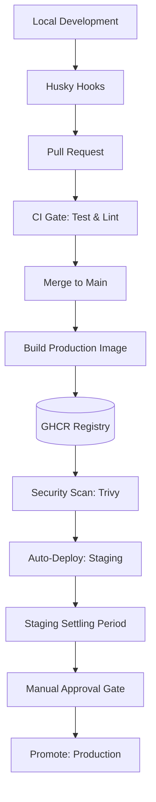

# Phalanx Duel CI/CD Pipeline

This document defines the authoritative release automation for Phalanx Duel,
from local verification through staging deploy and production promotion.

## 1. Pipeline Overview

The pipeline is designed for **high fidelity and safety**. The repo still
builds and pushes a GHCR artifact on `main`, but the actual Fly.io deploy jobs
currently deploy from source using `flyctl --remote-only` with
`fly.staging.toml` and `fly.production.toml`.



---

## 2. Phase 1: Local Development (Pre-Commit)

We use **Husky** and **lint-staged** to ensure that only quality code is committed.

### Pre-Commit Hook
- **Environment Check**: Rejects commits containing sensitive `.env` files (e.g., `.env.local`).
- **Linting**: Runs `eslint`, `prettier`, and `markdownlint` only on files staged for commit.
- **Project Gates**: Runs `rtk pnpm verify:full` which performs the full build, lint, typecheck, test, schema, docs, and formatting verification pass across the workspace.

### Pre-Push Hook
- Performs a final `rtk pnpm verify:full` to guarantee that the branch is ready for the remote repository.

---

## 3. Phase 2: Pull Request (The Gate)

On every PR to `main`, GitHub Actions triggers the **Test Job**.

- **Goal**: Verify that the changes are compatible with the integrated codebase.
- **Requirements**: All tests, linting, and typechecks must pass. The PR cannot be merged if this stage fails.

---

## 4. Phase 3: Main Branch (The Artifact)

Once merged into `main`, the pipeline switches to **Artifact Production**.

### Build and Push (`build` job)
- A production Docker image is built using the canonical `Dockerfile`.
- The image is pushed to **GitHub Container Registry (GHCR)**.
- **Tagging**: Every build is tagged with the git SHA and `latest-main`.
- This artifact is useful for scanning, inspection, and future deployment
  workflows, but it is **not** the runtime artifact currently promoted to Fly.

### Runtime Deployment Path
- **Staging deploy**: `.github/workflows/pipeline.yml` runs
  `flyctl deploy --app phalanxduel-staging --config fly.staging.toml --remote-only`.
- **Production promotion**: after staging succeeds, a maintainer manually
  approves the production environment and the workflow runs
  `flyctl deploy --app phalanxduel-production --config fly.production.toml --remote-only`.
- Because deploys currently happen from source, docs must not claim immutable
  "same image promoted from staging" behavior.
- Operational implication: promotion and rollback behave like rolling app
  restarts. Active matches should recover through persisted state and rejoin,
  but clients may need to reconnect and rollback does not rewind schema or
  persisted gameplay data.

---

## 5. Phase 4: Staging (The Sandbox)

Upon successful tests on `main`, the workflow automatically deploys staging via
Fly.io.

- **App**: `phalanxduel-staging`
- **URL**: [phalanxduel-staging.fly.dev](https://phalanxduel-staging.fly.dev)
- **Deployment Strategy**: rolling via Fly.io and the staging Fly config.
- **Verification**: Automatic health check (`/health`) and readiness check (`/ready`) gate.

---

## 6. Phase 5: Production (The Promotion)

Production releases are **never automatic**. They require manual approval after
staging succeeds.

### Promotion Gate
- **Manual Approval**: A maintainer must explicitly click **"Approve and Deploy"** in the GitHub Actions Environment UI.
- **Current deployment mode**: the workflow performs a second Fly.io remote
  deploy from the repo source using `fly.production.toml`.
- **Implication**: the process is staged and gated, but it is not yet a strict
  build-once immutable promotion flow.
- **Rollback constraint**: app rollback is only safe while the previous release
  remains compatible with the live schema and persisted state.

### Target Environment
- **App**: `phalanxduel-production`
- **Custom Domain**: `play.phalanxduel.com`
- **Infrastructure URL**: `phalanxduel-production.fly.dev`

---

## Failure Meanings & Actions

| Stage | Failure Meaning | Required Action |
|-------|-----------------|-----------------|
| **CI (Test)** | Logic, types, or formatting regression. | Fix code and push update. |
| **Build** | Docker build failure or registry auth issue. | Check Dockerfile and GitHub Secrets. |
| **Staging** | Unhealthy deployment in staging. | Inspect Fly.io logs; fix config or logic. |
| **Promotion** | Rejected manually or production outage. | Investigate staging stability or production infra. |

## Operational Recovery Notes

- Active-match restart recovery is supported through persisted player identity
  and reconnect, not through continuous socket survival.
- The reconnect deadline survives a server restart; operators should not expect
  a deploy or rollback to reset the forfeit timer.
- Schema or migration incidents require the database recovery path in
  `docs/ops/runbook.md`; Fly release rollback alone is not
  sufficient.

---

## MCP Server Deployment

The MCP server runs as two separate Fly.io apps so that the public and admin profiles are
structurally isolated. Each has its own `fly.*.toml` in `mcp/`.

### Apps

| App | Config | Profile | Access |
| --- | --- | --- | --- |
| `phalanxduel-mcp-public` | `mcp/fly.public.toml` | `public` | Public HTTPS (`/mcp`) |
| `phalanxduel-mcp-admin` | `mcp/fly.admin.toml` | `admin` | Internal only (`fly proxy`) |

### Initial Deploy

```bash
# Public app (auto-starts/stops, 256 MB)
fly deploy --config mcp/fly.public.toml

# Admin app (no public HTTP service, internal only)
fly deploy --config mcp/fly.admin.toml
fly secrets set MCP_ADMIN_TOKEN="$(openssl rand -hex 32)" \
  --app phalanxduel-mcp-admin
```

Set any required secrets for both apps:

```bash
fly secrets set DATABASE_URL="<postgres-uri>" ANTHROPIC_API_KEY="..." \
  --app phalanxduel-mcp-public
fly secrets set DATABASE_URL="<postgres-uri>" ANTHROPIC_API_KEY="..." \
  OPENAI_API_KEY="..." --app phalanxduel-mcp-admin
```

### Accessing the Admin App

The admin app has no public `[http_service]`. Access it through a Fly proxy tunnel:

```bash
fly proxy 8081:8080 --app phalanxduel-mcp-admin
# MCP is now reachable at http://127.0.0.1:8081/mcp
```

Add `phalanx-prod-admin` to `.mcp.json` with `Authorization: Bearer <MCP_ADMIN_TOKEN>` to use it
from Claude Code.

### MCP Deployment Does Not Follow the Main Pipeline

MCP apps are deployed independently with `fly deploy --config mcp/fly.*.toml`. They are not part of
the `pipeline.yml` automated promotion flow. Deploy them manually after verifying the tool set.

---

## Related Canonical Docs

- `docs/ops/deployment-checklist.md` for the operator-facing deployment
  checklist
- `docs/ops/runbook.md` for incident response and rollback
- `.github/workflows/pipeline.yml` for the exact automation source of truth
- `mcp/README.md` for MCP tool reference, profile matrix, and `.mcp.json` config
