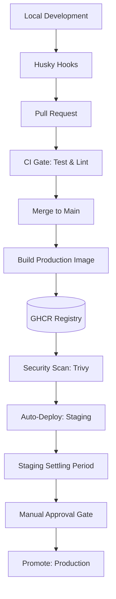

# Phalanx Duel CI/CD Pipeline

This document defines the authoritative release process for Phalanx Duel, from a developer's first commit to the final production deployment.

## 1. Pipeline Overview

The pipeline is designed for **high fidelity, build-once efficiency, and safety**.

---

## 2. Phase 1: Local Development (Pre-Commit)

We use **Husky** and **lint-staged** to ensure that only quality code is committed.

### Pre-Commit Hook
- **Environment Check**: Rejects commits containing sensitive `.env` files (e.g., `.env.local`).
- **Linting**: Runs `eslint`, `prettier`, and `markdownlint` only on files staged for commit.
- **Project Gates**: Runs `pnpm check:ci` which performs a full typecheck, build, test, and schema verification across the workspace.

### Pre-Push Hook
- Performs a final `pnpm check:ci` to guarantee that the branch is ready for the remote repository.

---

## 3. Phase 2: Pull Request (The Gate)

On every PR to `main`, GitHub Actions triggers the **Test Job**.

- **Goal**: Verify that the changes are compatible with the integrated codebase.
- **Requirements**: All tests, linting, and typechecks must pass. The PR cannot be merged if this stage fails.

---

## 4. Phase 3: Main Branch (The Artifact)

Once merged into `main`, the pipeline switches to **Artifact Production**.

### Build Once (`build` job)
- A production Docker image is built using the canonical `Dockerfile`.
- The image is pushed to **GitHub Container Registry (GHCR)**.
- **Tagging**: Every build is tagged with the git SHA and `latest-main`.

### Security & Size Scan (`scan` job)
- **Vulnerability Scan**: **Trivy** performs a deep scan of the image layers.
- **Compliance Gate**: The job fails if any **CRITICAL** or **HIGH** vulnerabilities are detected.
- **Size Audit**: Image size is verified against a 350MB limit to prevent bloat.

---

## 5. Phase 4: Staging (The Sandbox)

Upon successful build and scan, the artifact is automatically deployed to Fly.io Staging.

- **App**: `phalanxduel-staging`
- **URL**: [phalanxduel-staging.fly.dev](https://phalanxduel-staging.fly.dev)
- **Deployment Strategy**: Blue/Green (Rolling) via Fly.io.
- **Verification**: Automatic health check (`/health`) and readiness check (`/ready`) gate.

---

## 6. Phase 5: Production (The Promotion)

Production releases are **never automatic**. They represent a promotion of the verified staging artifact.

### Promotion Gate
- **Manual Approval**: A maintainer must explicitly click **"Approve and Deploy"** in the GitHub Actions Environment UI.
- **Immutability**: The pipeline pulls the **exact same Docker image** from GHCR that was verified in Staging. No new build is performed.

### Target Environment
- **App**: `phalanxduel-production`
- **Custom Domain**: `play.phalanxduel.com`
- **Infrastructure URL**: `phalanxduel-production.fly.dev`

---

## Failure Meanings & Actions

| Stage | Failure Meaning | Required Action |
|-------|-----------------|-----------------|
| **CI (Test)** | Logic, types, or formatting regression. | Fix code and push update. |
| **Build** | Docker build failure or registry auth issue. | Check Dockerfile and GitHub Secrets. |
| **Scan** | Security vulnerabilities or image bloat. | Update base image or dependencies. |
| **Staging** | Unhealthy deployment in staging. | Inspect Fly.io logs; fix config or logic. |
| **Promotion** | Rejected manually or production outage. | Investigate staging stability or production infra. |
