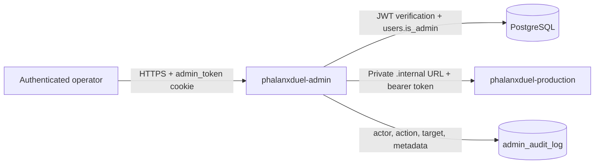

# Admin Operations

Phalanx Duel has one supported production operator architecture: the dedicated
`phalanxduel-admin` Fly application at
`https://phalanxduel-admin.fly.dev`. The game server does not host an operator
dashboard or accept legacy admin Basic Auth.

## Trust Boundary

The authorization sequence is:

1. `POST /admin-api/auth/login` forwards credentials to the game server's
   normal login endpoint.
2. The admin service verifies the returned JWT with the shared `JWT_SECRET`.
3. Before setting `admin_token`, the service confirms `users.is_admin = true`.
4. Every protected request repeats the JWT verification and current database
   administrator check, so revoked access does not remain authorized until
   token expiry.
5. State-changing game operations cross only the private Fly network and must
   present `ADMIN_INTERNAL_TOKEN`.

`JWT_SECRET`, `GAME_SERVER_INTERNAL_URL`, and `ADMIN_INTERNAL_TOKEN` have no
production fallback. Missing configuration prevents the dedicated service from
starting.

## Health and Release Identity

- `GET /health` is public liveness and returns only safe service, version,
  build, commit, uptime, region, and timestamp fields.
- `GET /ready` performs a bounded `SELECT 1`; it returns `503` when PostgreSQL
  is unavailable.
- Fly routes only the dedicated `admin` process and requires both probes to
  pass. The required subsystem keeps one Machine running.

## Authenticated Reads

Representative harmless reads include:

- `GET /admin-api/matches?limit=1`
- `GET /admin-api/users?limit=1`
- `GET /admin-api/system/ab-tests`
- `GET /admin-api/matches/:matchId/replay`

The last two are proxied through private bearer-authenticated game-server
routes. Anonymous or malformed cookies receive `401`; authenticated users who
are not current administrators receive `403`.

## Mutations and Audit

Mutations require the same per-request administrator check. Match creation,
termination, rollback, password reset, and administrator-role changes write
`admin_audit_log` rows containing the actor id, action, optional target id, and
structured metadata. Moderation operations pass the actor id to the game
server's moderation service, which owns their audit semantics.

Audit writes occur only after the corresponding upstream mutation succeeds.
An upstream authorization or operation failure is returned without recording a
false successful action.

## Retired Game-Server Routes

The following historical routes return `410 ADMIN_SURFACE_RETIRED` and do not
accept Basic Auth:

- `GET https://play.phalanxduel.com/admin`
- `GET https://play.phalanxduel.com/admin/ab-tests`
- `GET https://play.phalanxduel.com/matches/:matchId/replay`

Legacy `/api/admin/*` routes are not registered and return `404`. Operator
automation must use the dedicated service; internal `/internal/*` routes are
not operator-facing APIs.

## Production Verification

During a zero-active-match release window:

1. Confirm the game and admin `/health` and `/ready` probes report the same
   approved commit SHA.
2. Confirm an anonymous admin API read returns `401`.
3. Log in as a current administrator and perform a harmless read.
4. Perform only an explicitly approved reversible mutation, then verify the
   matching `admin_audit_log` row and actor.
5. Confirm the three retired game-server routes return `410` and
   `/api/admin/*` returns `404`.

The production deployment, rollback, and whole-system certification rules are
defined by the
[Production Support Contract](../ops/production-support-contract.md).
