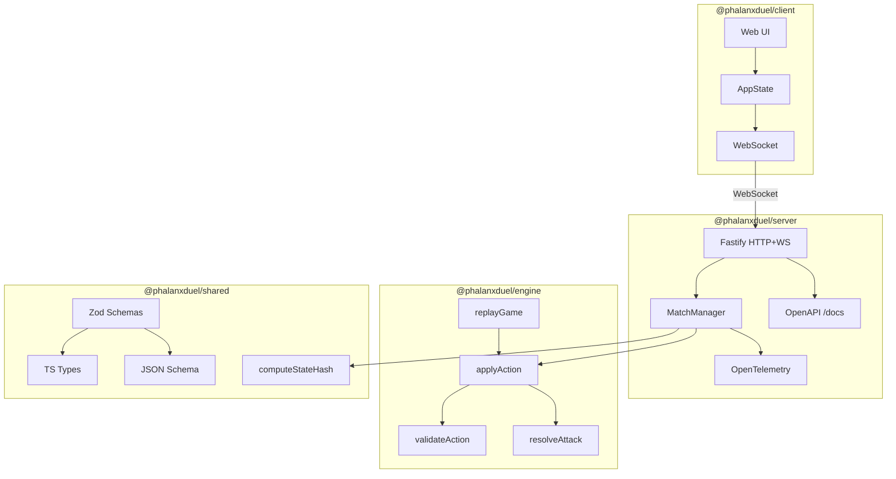

# Architecture

## Core Principle

Server-authoritative. Clients send intents; the server validates via the engine and broadcasts resulting state. Clients trust nothing — no game logic runs client-side.



## Dependency Direction

```text
shared ← engine ← server
shared ← client
```

`engine` and `client` have no dependency on each other. The engine has no server knowledge. Boundaries are enforced by dependency-cruiser (`docs/system/dependency-graph.svg`).

## Why Deterministic

All game state derives from an ordered sequence of inputs. v1.0 mandates strict replay guarantees:

- Engine functions are pure: `(state, action) → next state`
- RNG is injected so tests and replays use a fixed seed
- The hash function is injected so the engine has no environment dependencies
- Turn phases always emit events even with no state change, ensuring a consistent observable execution path

The 7-phase turn loop (in order): `StartTurn` → `AttackPhase` → `AttackResolution` → `CleanupPhase` → `ReinforcementPhase` → `DrawPhase` → `EndTurn`. See [`docs/RULES.md`](../RULES.md) for definitions. See `engine/src/state-machine.ts` for the authoritative implementation.

## Hashing Design

Per-transaction replay integrity via `stateHashBefore` and `stateHashAfter`. Both hashes **exclude `transactionLog`** deliberately — including it would create a circular dependency since each log entry contains hashes of the state before that entry was appended.

The hash function is injected into the engine via `computeStateHash` from `@phalanxduel/shared/hash`. The full transaction log entry shape is in `shared/src/schema.ts`.
