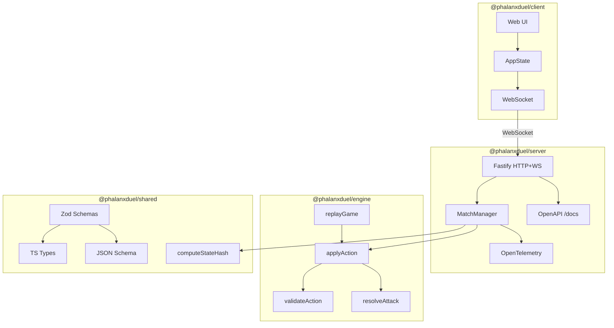

# Phalanx Duel — Architecture

## Overview

Phalanx Duel uses a **server-authoritative** architecture. The server is the single
source of truth for all game state. Clients send intents; the server validates
them against the rules engine and broadcasts the resulting state.



## Packages

### @phalanxduel/engine

Pure, deterministic rules engine. No I/O, no transport, no randomness (RNG is
injected). Every function takes a game state and an action, returns the next
state. This makes all transitions fully testable and replayable.

### @phalanxduel/server

Authoritative match server. Responsibilities:
- Accept client connections (HTTP + WebSocket)
- Validate actions through the engine
- Persist and broadcast state transitions
- Emit OpenTelemetry traces and metrics for every action
- Expose OpenAPI spec at `/docs` via `@fastify/swagger`
- Provide match replay validation via `GET /matches/:matchId/replay`

### @phalanxduel/client

Web UI. Sends player intents to the server, renders state received back. No
game logic — the client trusts the server's state.

### @phalanxduel/shared

Zod schemas as the single source of truth for data contracts. Generates:
- TypeScript types (`shared/src/types.ts`)
- JSON Schema snapshots (`shared/json-schema/*.json`)

Also contains the deterministic state hashing utility (`computeStateHash`).

## Turn Lifecycle (Deterministic)

Each turn executes all 7 phases as defined in `docs/RULES.md`:

1.  **StartTurn**
2.  **AttackPhase**
3.  **AttackResolution**
4.  **CleanupPhase**
5.  **ReinforcementPhase**
6.  **DrawPhase**
7.  **EndTurn**

Phases always emit events, even if no state changes, ensuring a consistent and observable execution path.

## Event Sourcing & Determinism

Game state is derived from an ordered sequence of turns and their inputs. v1.0 mandates a strict deterministic replay guarantee.

### Hashing Model

Every turn produces a `turnHash` derived from:
- `specVersion`
- `params` (Match Configuration)
- `preStateHash`
- `turnInput` (Action)
- `eventLogHash`
- `postStateHash`

```text
turnHash = sha256(specVersion + params + preStateHash + turnInput + eventLogHash + postStateHash)
```

### Transaction Log Entry Structure

Every turn produces a log entry containing:
- `sequenceNumber` — ordinal position in the log
- `action` — the action that was applied
- `turnHash` — the SHA-256 hash verifying the transition
- `timestamp` — ISO-8601 datetime
- `events` — ordered list of events emitted during the 7 phases (including `boundary_evaluated`)

The hash function is injected into the engine so it remains environment-agnostic. The server passes `computeStateHash` from `@phalanxduel/shared/hash`.

## Data Flow

1. Client sends an action intent via WebSocket.
2. Server validates the action and executes the 7-phase turn lifecycle.
3. Engine returns the updated state, the event log, and the `turnHash`.
4. Server persists the turn and broadcasts the new state and events to all clients.
5. Each step is wrapped in an OpenTelemetry span.

```text
1. Client sends an action intent via WebSocket.
2. Server validates the action and executes the 7-phase turn lifecycle.
3. Engine returns the updated state, the event log, and the `turnHash`.
4. Server persists the turn and broadcasts the new state and events to all clients.
5. Each step is wrapped in an OpenTelemetry span.
```
