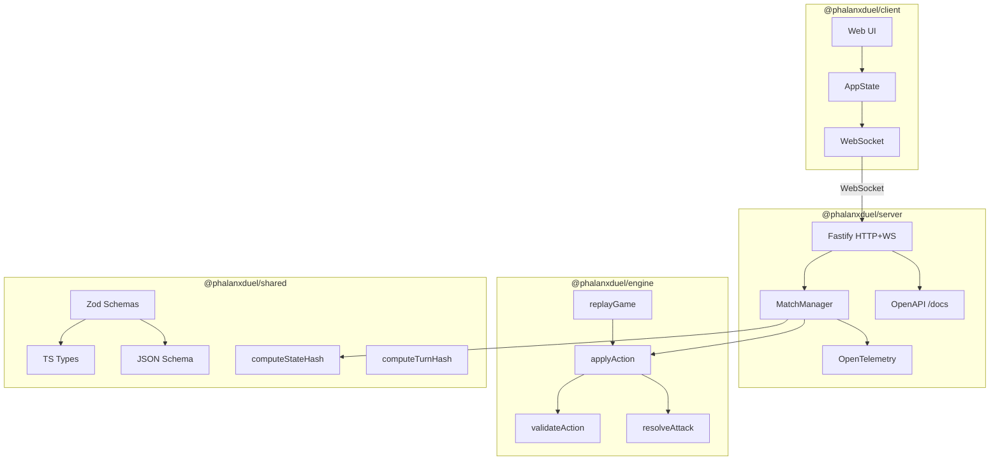

# Architecture

## Core Principle

Server-authoritative. Clients send intents; the server validates via the engine and broadcasts resulting state. Clients trust nothing — no game logic runs client-side.



## Dependency Direction

```text
shared ← engine ← server
shared ← client
```

`engine` and `client` have no dependency on each other. The engine has no server knowledge. Boundaries are enforced by dependency-cruiser (`docs/system/dependency-graph.svg`).

## Supported Client Surfaces

The browser app in `client/` remains the canonical first-party implementation.
The Go duel CLI in `clients/go/duel-cli/` is also part of the supported
reference architecture. Generated SDKs under `sdk/` are contract artifacts for
REST and typed WebSocket messages, not full runtime transports.

Use [`docs/system/CLIENT_COMPATIBILITY.md`](./CLIENT_COMPATIBILITY.md) for the
current support matrix across browser, Go, and generated SDK consumers.

## Canonical Sequence Views

The rendered SVGs under `docs/system/` are the canonical sequence views used by
the Dash docset and contributor docs:

- `gameplay-sequence-1.svg` — client intent to server validation, engine apply,
  shared contract work, and broadcast.
- `observability-sequence-1.svg` — collector-first telemetry flow from browser
  and server runtimes to the centralized LGTM path.

## Why Deterministic

All game state derives from an ordered sequence of inputs. v1.0 mandates strict replay guarantees:

- Engine functions are pure: `(state, action) → next state`
- RNG is injected so tests and replays use a fixed seed
- The hash function is injected so the engine has no environment dependencies
- Turn phases always emit events even with no state change, ensuring a consistent observable execution path

The 8-phase turn loop (in order): `StartTurn` → `DeploymentPhase` (optional) → `AttackPhase` → `AttackResolution` → `CleanupPhase` → `ReinforcementPhase` → `DrawPhase` → `EndTurn`. See [`docs/RULES.md`](../RULES.md) for definitions. See `engine/src/state-machine.ts` for the authoritative implementation.

## Horizontal Scaling Seam

The system is designed for a transition from a single-node in-memory state to a distributed, multi-node backplane. This is facilitated by the `IMatchManager` interface in the server.

- **`IMatchManager`**: Abstract interface for match lifecycle operations (create, join, action, broadcast).
- **`MatchManager`**: The default local, in-memory implementation.
- **Composition**: The Fastify application (`buildApp`) is injected with an `IMatchManager` instance, decoupling the WebSocket/HTTP transport from the specific match management strategy.

This seam allows for a future `DistributedMatchManager` implementation that can use Neon's `LISTEN/NOTIFY` or similar pub/sub mechanisms to synchronize state across multiple server instances without modifying the core app routes or engine integration.

## Hashing Design

Per-transaction replay integrity via `stateHashBefore` and `stateHashAfter`. Both hashes **exclude `transactionLog`** deliberately — including it would create a circular dependency since each log entry contains hashes of the state before that entry was appended.

The hash function is injected into the engine via `computeStateHash` from `@phalanxduel/shared/hash`. The full transaction log entry shape is in `shared/src/schema.ts`.

**TurnHash** is the canonical per-turn signature (RULES.md §20.2):

```text
turnHash = SHA-256(stateHashAfter + ":" + eventIds.join(":"))
```

Computed by `computeTurnHash` from `@phalanxduel/shared/hash` and included in `PhalanxTurnResult` on every broadcast. It is independently verifiable from the event log and state hash alone — no replay required.

## Reliability & Persistence

The Phalanx system prioritizes durability and auditability for competitive play and operational recovery.

- **Match State**: The `matches` table stores the current `GameState` snapshot for fast retrieval and broadcast.
- **Durable Audit Trail**: A normalized `transaction_logs` table stores an append-only ledger of every action applied to a match. Each row includes the action, the state hashes before/after, and the turn-derived events.
- **Append-Only Ledger**: By persisting actions individually rather than as a growing JSON blob, the system prevents data loss during concurrent updates and allows for granular "point-in-turn" recovery.
- **Verification**: Replay integrity is verified by re-applying the actions in the ledger and confirming that the computed `stateHashAfter` matches the persisted hash for every step.

## Event Log

Each turn produces a `PhalanxEvent[]` derived deterministically from the `TransactionLogEntry` by `deriveEventsFromEntry` in `engine/src/events.ts`. Events follow a span-based model (RULES.md §17) — every phase emits `span_started`/`span_ended` plus `functional_update` events for state changes.

The full event log for a match (`MatchEventLog`) is persisted to the database and queryable via HTTP:

- `GET /matches/completed` — paginated list of completed match summaries (matchId, players, outcome, turn count, fingerprint)
- `GET /matches/:id/log` — full event log with content negotiation: `text/html` → rendered HTML, `?format=compact` → token-efficient JSON, default → full structured JSON

The client surfaces this via a "View Log" link on the game-over screen and a "Past Games" panel in the lobby (lazy-loaded from `GET /matches/completed`).

CI enforces event log completeness via `pnpm rules:check` → `scripts/ci/verify-event-log.ts`, which verifies every action type reachable from the engine produces a non-empty `PhalanxEvent[]`.
