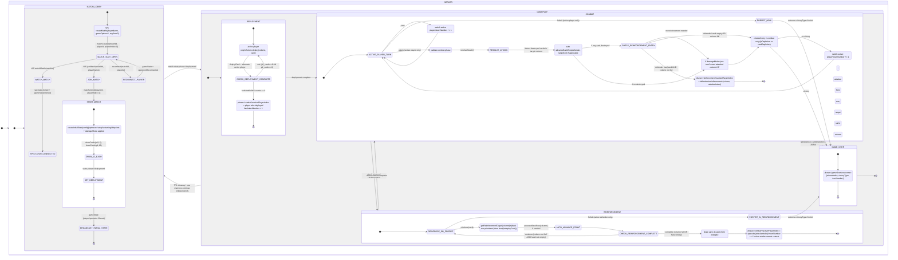

# Game State Machine

This diagram reflects the current implemented game lifecycle across the server match flow and engine phase transitions.

```mermaid
stateDiagram-v2
    direction LR

    [*] --> SERVER

    state SERVER {
        direction LR

        [*] --> MATCH_LOBBY

        state MATCH_LOBBY {
            direction TB
            [*] --> CREATE_MATCH_SLOT

            CREATE_MATCH_SLOT : WS createMatch(playerName, gameOptions?, rngSeed?)
            CREATE_MATCH_SLOT --> MATCH_SLOT_OPEN : matchCreated(matchId, playerId, playerIndex=0)

            MATCH_SLOT_OPEN --> JOIN_MATCH : WS joinMatch(matchId, playerName)
            JOIN_MATCH --> START_MATCH : matchJoined(playerId, playerIndex=1)

            state START_MATCH {
                direction TB
                [*] --> INIT_ENGINE_STATE
                INIT_ENGINE_STATE : createInitialState(config)\nphase='setup'\nstartingLifepoints + damageMode applied
                INIT_ENGINE_STATE --> DRAW_12_EACH : drawCards(p0,12), drawCards(p1,12)
                DRAW_12_EACH --> SET_DEPLOYMENT : state.phase='deployment'
                SET_DEPLOYMENT --> [*]
            }

            START_MATCH --> BROADCAST_INITIAL_STATE : gameState (player/spectator filtered)
            BROADCAST_INITIAL_STATE --> [*]

            MATCH_SLOT_OPEN --> WATCH_MATCH : WS watchMatch(matchId)
            WATCH_MATCH --> SPECTATOR_CONNECTED : spectatorJoined + gameState(filtered)

            MATCH_SLOT_OPEN --> RECONNECT_PLAYER : reconnect(matchId, playerId)
            RECONNECT_PLAYER --> MATCH_SLOT_OPEN : gameState + opponentReconnected
        }

        MATCH_LOBBY --> GAMEPLAY : match.state.phase='deployment'

        state GAMEPLAY {
            direction LR
            [*] --> DEPLOYMENT

            state DEPLOYMENT {
                direction TB
                [*] --> DEPLOY_TURN

                DEPLOY_TURN : active player only\nAction=deploy(column, card)
                DEPLOY_TURN --> CHECK_DEPLOYMENT_COMPLETE : deployCard + alternate active player

                CHECK_DEPLOYMENT_COMPLETE --> DEPLOY_TURN : not (p0_cards==8 && p1_cards==8)
                CHECK_DEPLOYMENT_COMPLETE --> ENTER_COMBAT : both battlefield counts == 8

                ENTER_COMBAT : phase='combat'\nactivePlayerIndex = player who deployed last\nturnNumber = 1
                ENTER_COMBAT --> [*]
            }

            DEPLOYMENT --> COMBAT : deployment complete

            state COMBAT {
                direction TB
                [*] --> ACTIVE_PLAYER_TURN

                ACTIVE_PLAYER_TURN --> PASS_TURN : pass
                ACTIVE_PLAYER_TURN --> FORFEIT_NOW : forfeit (active player only)
                ACTIVE_PLAYER_TURN --> ATTACK : attack (active player only)

                ATTACK : validate combat phase; attacker front row; target same column
                ATTACK --> RESOLVE_ATTACK : resolveAttack()

                RESOLVE_ATTACK --> POST_ATTACK_COLUMN_CLEANUP : detect destroyed cards in target column
                POST_ATTACK_COLUMN_CLEANUP : auto advanceBackRow(defender, targetCol) if applicable

                POST_ATTACK_COLUMN_CLEANUP --> CHECK_REINFORCEMENT_ENTRY : if any card destroyed
                POST_ATTACK_COLUMN_CLEANUP --> OPTIONAL_PER_TURN_RESET : if no destroyed

                CHECK_REINFORCEMENT_ENTRY --> OPTIONAL_PER_TURN_RESET : no reinforcement needed
                CHECK_REINFORCEMENT_ENTRY --> CHECK_VICTORY_AFTER_ATTACK : defender hand empty OR column full
                CHECK_REINFORCEMENT_ENTRY --> ENTER_REINFORCEMENT : defender has hand AND column not full

                ENTER_REINFORCEMENT : phase='reinforcement'\nactivePlayerIndex = defender\nreinforcement={column, attackerIndex}
                ENTER_REINFORCEMENT --> [*]

                OPTIONAL_PER_TURN_RESET : if damageMode='per-turn'\nreset attacked column HP
                OPTIONAL_PER_TURN_RESET --> CHECK_VICTORY_AFTER_ATTACK

                CHECK_VICTORY_AFTER_ATTACK : checkVictory in combat only (lpDepletion or cardDepletion)
                CHECK_VICTORY_AFTER_ATTACK --> GAME_OVER : victory
                CHECK_VICTORY_AFTER_ATTACK --> NEXT_COMBAT_TURN : no victory

                NEXT_COMBAT_TURN : switch active player\nturnNumber += 1
                NEXT_COMBAT_TURN --> ACTIVE_PLAYER_TURN

                PASS_TURN : switch active player\nturnNumber += 1
                PASS_TURN --> ACTIVE_PLAYER_TURN

                FORFEIT_NOW --> GAME_OVER : outcome.victoryType='forfeit'
            }

            COMBAT --> REINFORCEMENT : attack triggered reinforcement

            state REINFORCEMENT {
                direction TB
                [*] --> REINFORCE_OR_FORFEIT

                REINFORCE_OR_FORFEIT --> FORFEIT_IN_REINFORCEMENT : forfeit (active defender only)
                REINFORCE_OR_FORFEIT --> PLACE_REINFORCEMENT : reinforce(card)

                PLACE_REINFORCEMENT : getReinforcementTarget(column)\n(back row prioritized, then front)\ndeployCard()
                PLACE_REINFORCEMENT --> AUTO_ADVANCE_FRONT : advanceBackRow(column) if needed
                AUTO_ADVANCE_FRONT --> CHECK_REINFORCEMENT_COMPLETE

                CHECK_REINFORCEMENT_COMPLETE --> REINFORCE_OR_FORFEIT : continue (column not full AND hand not empty)
                CHECK_REINFORCEMENT_COMPLETE --> DRAW_TO_FOUR : complete (column full OR hand empty)

                DRAW_TO_FOUR : draw up to 4 cards from drawpile
                DRAW_TO_FOUR --> RETURN_TO_COMBAT

                RETURN_TO_COMBAT : phase='combat'\nactivePlayerIndex = opposite(attackerIndex)\nturnNumber += 1\nclear reinforcement context
                RETURN_TO_COMBAT --> [*]

                FORFEIT_IN_REINFORCEMENT --> GAME_OVER : outcome.victoryType='forfeit'
            }

            REINFORCEMENT --> COMBAT : reinforcement complete
            COMBAT --> GAME_OVER : lpDepletion | cardDepletion | forfeit

            state GAME_OVER {
                direction TB
                [*] --> OUTCOME_SET
                OUTCOME_SET : phase='gameOver'\noutcome={winnerIndex, victoryType, turnNumber}
                OUTCOME_SET --> [*]
            }

            GAME_OVER --> [*]
        }

        GAMEPLAY --> MATCH_LOBBY : TTL cleanup / new matches continue independently
    }
```
