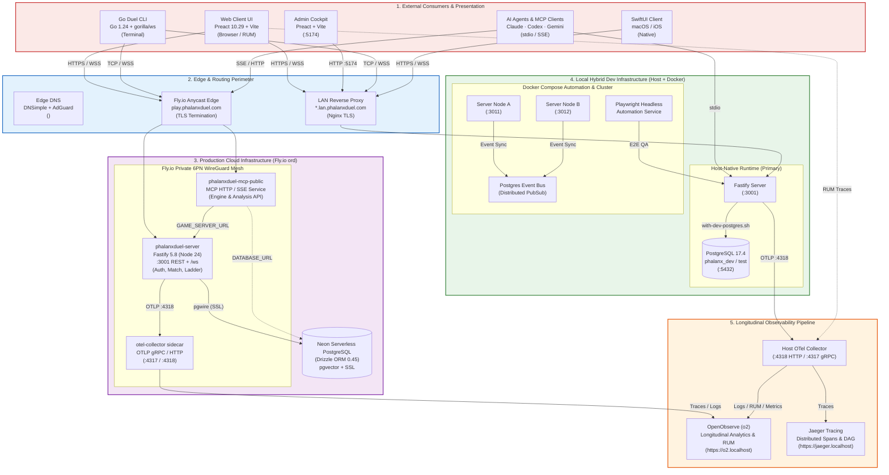

# Phalanx Duel Infrastructure & Deployment Topology

> **Generated**: Automatically generated by `pnpm infra:diagram`  
> **Visual Reference**: [infrastructure-topology.svg](./infrastructure-topology.svg) | [infrastructure-topology.mmd](./infrastructure-topology.mmd)

## Overview

Phalanx Duel operates a **Hybrid Host-Native & Cloud Architecture**:
1. **Host-Native Inner Loop**: Local server and browser UI run natively on macOS/Linux for rapid iteration and zero container overhead.
2. **Cloud Production on Fly.io**: Fastify backend and public MCP server run in isolated Fly machines connected to Neon Serverless PostgreSQL with pgvector.
3. **Observability Pipeline**: All telemetry (RUM, traces, structured logs, metrics) passes via OpenTelemetry Collector into OpenObserve (`o2`) and Jaeger.
4. **Isolated Database Tiers**: Dev, test, and tooling databases are separated by PostgreSQL roles and enforced via wrapper scripts (`with-dev-postgres.sh`, `with-test-postgres.sh`).

## Topology Diagram

## Subsystems & Ports Reference

| Subsystem | Environment | Host / Port | Transport | Purpose |
|---|---|---|---|---|
| **Fastify Server** | Prod / Staging | `play.phalanxduel.com` | HTTPS + WSS | Game API, Matchmaking, Replays |
| **Fastify Server** | Local Dev | `127.0.0.1:3001` | HTTP + WS | Host-native development |
| **MCP Public Service** | Prod | `phalanxduel-mcp-public.fly.dev` | HTTP / SSE | LLM & Agentic Game Interface |
| **Web Client UI** | Local Dev | `127.0.0.1:5173` | HTTP | Reference Browser UI (Vite) |
| **Admin Cockpit** | Local Dev | `127.0.0.1:5174` | HTTP | Operational match intervention |
| **Cluster Node A** | Local Docker | `127.0.0.1:3011` | HTTP + WS | Horizontal scaling testing |
| **Cluster Node B** | Local Docker | `127.0.0.1:3012` | HTTP + WS | Horizontal scaling testing |
| **PostgreSQL** | Local Dev | `127.0.0.1:5432` | pgwire | Local development & test DB |
| **Neon PostgreSQL** | Cloud Prod | Neon Cloud (SSL) | pgwire | Production database with pgvector |
| **OTel Collector** | Host / Cloud | `127.0.0.1:4318` / `:4317` | HTTP / gRPC | Telemetry ingestion & routing |
| **OpenObserve (o2)** | Observability | `https://o2.localhost` | HTTPS | Structured logs, metrics, RUM |
| **Jaeger** | Observability | `https://jaeger.localhost` | HTTPS | Distributed trace analysis |
