# Site Flow Map

This document maps how users move through Phalanx Duel screens and how those
transitions are triggered.

Source of truth:

- `client/src/main.ts`
- `client/src/state.ts`
- `client/src/renderer.ts`
- `client/src/lobby.ts`
- `client/src/game.ts`
- `client/src/game-over.ts`
- `server/src/app.ts`

## Generate SVGs (Marked Friendly)

Marked does not render Mermaid blocks directly. Generate static SVGs alongside
this doc:

```bash
./scripts/docs/render-site-flow.sh
```

Outputs:

- `docs/system/site-flow-1.svg`
- `docs/system/site-flow-2.svg`

Mermaid sources:

- `docs/system/site-flow-1.mmd`
- `docs/system/site-flow-2.mmd`

## Frontend Screen Flow



## Screen Inventory

| Screen ID | Render Path | Entry Conditions | Exit Paths | Discoverability |
| --- | --- | --- | --- | --- |
| `lobby.standard` | `renderLobby` | `state.screen = lobby` and no `match/watch` URL params | create, join, watch, or URL param changes on reload | Primary |
| `lobby.join-link` | `renderJoinViaLink` | `state.screen = lobby` and `?match=` present | accept join, or "Start your own match instead" | Link-only |
| `lobby.watch-connecting` | `renderWatchConnecting` | `state.screen = lobby` and `?watch=` present | auto `watchMatch` on WS open, or cancel | Link-only |
| `waiting` | `renderWaiting` | WS `matchCreated` | receives `gameState` -> game | Primary (host path) |
| `game.player` | `renderGame` | `state.screen = game` and `isSpectator = false` | repeated gameState updates, eventually gameOver | Primary |
| `game.spectator` | `renderGame` | `state.screen = game` and `isSpectator = true` | repeated gameState updates, eventually gameOver | Indirect |
| `gameOver.player` | `renderGameOver` | `state.screen = gameOver` and player context | Play Again -> lobby reset | Primary |
| `gameOver.spectator` | `renderGameOver` | `state.screen = gameOver` and spectator context | Play Again -> lobby reset | Indirect |

## Trigger Matrix (State + Transport)

| From | Trigger | Condition | To | Where Implemented |
| --- | --- | --- | --- | --- |
| startup | initial state | app boot | `lobby.standard` or URL lobby variants | `client/src/main.ts`, `client/src/lobby.ts` |
| any lobby variant | WS open auto-watch | URL has `watch` | `game.spectator` (after `spectatorJoined`) | `client/src/main.ts`, `client/src/state.ts` |
| `lobby.standard` | Create Match click | valid name | `waiting` on `matchCreated` | `client/src/lobby.ts`, `client/src/state.ts` |
| `lobby.standard` | Play vs Bot click | valid name | `waiting` on `matchCreated` | `client/src/lobby.ts`, `client/src/state.ts` |
| `lobby.standard`/`lobby.join-link` | Join click | valid name + match id | screen unchanged on `matchJoined`; then `game.player` on `gameState` | `client/src/lobby.ts`, `client/src/state.ts` |
| `lobby.standard` | Watch click | match id | `game.spectator` on `spectatorJoined` | `client/src/lobby.ts`, `client/src/state.ts` |
| `waiting` | server broadcast | `gameState.phase != gameOver` | `game.player` | `client/src/state.ts` |
| `game.player` or `game.spectator` | server broadcast | `gameState.phase == gameOver` | `gameOver.player` or `gameOver.spectator` | `client/src/state.ts`, `client/src/game-over.ts` |
| `gameOver.*` | Play Again click | always | `lobby.standard` | `client/src/game-over.ts`, `client/src/state.ts` |
| `lobby.join-link` | Start your own match instead | always | `lobby.standard` | `client/src/lobby.ts`, `client/src/state.ts` |
| `lobby.watch-connecting` | Cancel and return to lobby | always | `lobby.standard` | `client/src/lobby.ts`, `client/src/state.ts` |

## Non-Obvious Paths and Caveats

1. `matchJoined` does not set `screen`; it only updates identifiers. The UI
   remains on the current screen until a `gameState` message arrives.
2. `?watch=` takes priority over session rejoin on WebSocket open.
3. Saved-session auto rejoin only runs when `state.screen === 'lobby'`.
4. `spectatorJoined` sets `screen = game` immediately, before first `gameState`.
5. URL params are cleared on `matchJoined` and on `resetToLobby`.

## HTTP/WS Surface (For Complete Site Reasoning)


