# Technology Stack & Longitudinal Observability Architecture Catalog

> **Document Status**: Canonical Architecture Catalog  
> **Audience**: Platform Engineers, Presenters, Autonomous AI Agents  
> **Initiative**: Panoramic View Labs (PVL) Longitudinal Cartography  
> **Last Verified**: 2026-09-06 (Commit `29636679` / Demo System Live Audit)

---

## 1. Executive Summary & PVL Longitudinal Framework

This catalog provides an exhaustive, outside-in cartographic inventory of the Phalanx Duel system. It establishes how each layer—from external edge DNS, reverse proxies, and multi-platform clients down to the pure deterministic game engine—interfaces with the system's OpenTelemetry-native observability pipeline.

### Panoramic View Labs (PVL) Context
* **Panoramic View**: The investigation technique and system-cartography methodology.
* **Panoramic View Labs (PVL)**: The organizational initiative and longitudinal analysis framework. PVL treats architecture not as static diagrams, but as longitudinal invariants tracked across time, releases, and operational replay journeys.
* **Pavel**: The Panoramic View specialist agent.
* **zdots**: The root local-system platform powering PVL tooling, host daemons, and inference helpers.

Every layer in this catalog is designed with **strict inward dependency direction** and **zero observability pollution** in the sacred core.

---

## 2. Outside-In Concentric Architecture (Onion Model)

The system is structured into seven concentric rings. Volatile external dependencies, cloud infrastructure, and network protocols reside at the outer perimeter. As one moves inward, components become increasingly stable, deterministic, and isolated.

```mermaid
graph TD
    subgraph L1["Layer 1: Edge & Network Perimeter"]
        DNS["Edge DNS (DNSimple + AdGuard 10.36.1.149)"]
        Nginx["Nginx Reverse Proxy (*.lan.phalanxduel.com)"]
        Fly["Fly.io Cloud + Local Docker Compose"]
    end

    subgraph L2["Layer 2: Observability Ingestion & Sinks"]
        O2["OpenObserve (o2.localhost)"]
        Jaeger["Jaeger (jaeger.localhost)"]
        Grafana["Grafana LGTM (localhost:3000 - Standby)"]
        OTelCol["OTel Collector Contrib (:4318 / :4317)"]
    end

    subgraph L3["Layer 3: Clients & Presentation Touchpoints"]
        WebClient["Web Client UI (Preact 10.29 + Vite 8)"]
        AdminUI["Admin UI (Preact 10.29 + Vite 8)"]
        GoCLI["Go Duel CLI (Go 1.24 + gorilla/websocket)"]
        SwiftUI["SwiftUI Client (Swift 6.0)"]
        RUM["@openobserve/browser-rum 0.4.2"]
        WebOTel["@opentelemetry/sdk-trace-web 2.7.1"]
    end

    subgraph L4["Layer 4: Server Gateway & Transport Frameworks"]
        Node["Node.js 24.14.0 + pnpm 10.33.2"]
        Fastify["Fastify 5.8.5 (@fastify/websocket, jwt, helmet)"]
        NodeOTel["@opentelemetry/sdk-node 0.218.0"]
        Pino["Pino Structured Logger (logs/server.log)"]
    end

    subgraph L5["Layer 5: Data Persistence & Database Adapters"]
        Postgres["PostgreSQL 17.4 (phalanx_dev / Neon Serverless)"]
        Drizzle["Drizzle ORM 0.45.2 + Drizzle-Kit 0.31.10"]
        PgDriver["postgres.js 3.4.9"]
        Guards["bin/maint/with-dev-postgres.sh (Isolation Guards)"]
    end

    subgraph L6["Layer 6: Shared Wire Contracts & Validation"]
        Shared["@phalanxduel/shared 1.5.0"]
        Zod["Zod 4.4.3 (DTOs, Action Enums, TurnViewModel)"]
        CryptoHash["Canonical Per-Turn SHA-256 Hashing"]
    end

    subgraph L7["Layer 7: The Sacred Core (Pure Deterministic Engine)"]
        Engine["@phalanxduel/engine 1.5.0 (TypeScript 6.0.3 ESM)"]
        FSM["Combat State Machine & Bot AI Heuristics"]
        Explanations["Combat Explanation Surface (HEART SHIELD causes)"]
        ZeroDep["ZERO Third-Party Runtime Dependencies"]
    end

    L1 --> L2
    L1 --> L3
    L3 --> L4
    L2 <-.->|Telemetry Ingestion| L3
    L2 <-.->|Telemetry Ingestion| L4
    L4 --> L5
    L4 --> L6
    L5 --> L6
    L6 --> L7
```



---

## 3. Comprehensive Layer-by-Layer Inventory

### Layer 1: Edge, DNS & Network Perimeter

| Component | Technology | Project Configuration | Upstream Status & Drift | Architecture & Observability Role |
|---|---|---|---|---|
| **Edge DNS** | DNSimple (Public) + AdGuard Home (LAN) | Public `play.phalanxduel.com` (`66.241.124.240`); Local LAN `*.lan.phalanxduel.com` $\rightarrow$ `10.36.1.149` (TTL 60s) | **In Lockstep**: Zero drift. | Directs client ingress to edge termination without public cloud round-trip during local demos. |
| **Edge Proxy / TLS Gateway** | Nginx | 1.27.x (Managed via host `zsvc nginx` & container ingress) | **Current Stable**: No drift. | Terminates TLS, proxies HTTP/2 and WebSocket connections, and provides same-origin `/otel` reverse-proxy to avoid CORS during browser telemetry ingestion. |
| **Cloud Hosting Tier** | Fly.io (`fly.toml`) | Multi-region deployment, internal private wireguard mesh | **Production Parity**: Monitored via health checks. | Runs the canonical production Docker image with sidecar OpenTelemetry collector. |
| **Containerization Tier** | Docker & Docker Compose | Docker Engine 27.x, Compose v2 | **Current Stable** | Provides isolated test verification (`bin/dock pnpm verify:full`) and optional multi-node clustering. |

---

### Layer 2: Observability Ingestion & Sinks (The Telemetry Boundary)

*Standardized per [ADR-026](file:///Users/mike/github.com/phalanxduel/game/docs/adr/ADR-026-otel-native-observability-and-sentry-deprecation.md). Sentry and SigNoz are completely removed.*

| Component / Package | Technology | Local Version | Upstream Status | Role & Drift Evaluation |
|---|---|---|---|---|
| **OpenObserve (`o2.localhost`)** | OpenObserve (Rust) | `v0.14.x` / 2026 release | **Active Primary (200 OK)** | Primary longitudinal analytics sink. Stores structured logs, RED metrics, and RUM sessions. |
| **Jaeger (`jaeger.localhost`)** | Jaeger Tracing v2 | `v2.x` | **Active Primary (200 OK)** | Deep trace search, waterfall analysis, service dependency cartography, and cross-span latency attribution. |
| **Grafana LGTM (`:3000`)** | Grafana, Mimir, Tempo, Loki | Compose cluster profile | **Cold Standby (Offline)** | Standby unified dashboard. Not booted by default in lightweight demo mode; accessible via Compose when enabled. |
| **OpenTelemetry Collector Contrib** | Golang OTel Collector | Contrib 0.118+ | **Cutting Edge** | Dual intake (`:4318` OTLP/HTTP, `:4317` OTLP/gRPC). Filelog receiver tails `./logs/server.log` with JSON parsing and `trace_parser` correlation. Emits OTLP/HTTP to OpenObserve and Jaeger. |

---

### Layer 3: Client Applications & Presentation Touchpoints (The Edges)

| Client / Package | Technology & Version | Dependencies | Upstream Status & Drift | Role & Observability Hook |
|---|---|---|---|---|
| **Browser Web Client** | Preact `^10.29.1`, Vite `^8.0.16` | `@phalanxduel/shared`, `@phalanxduel/engine` | **Bleeding Edge (Vite 8 Rolldown)** | Primary interactive game UI. Emits user interactions, renders animated turn outcomes, and provides combat feedback overlays. |
| **Browser RUM** | `@openobserve/browser-rum` `^0.4.2`, `@openobserve/browser-logs` `^0.4.2` | Native Web APIs | **Current Stable** | Captures Core Web Vitals (LCP, INP, CLS), browser console errors, and page load session tracks directly to OpenObserve. |
| **Browser Tracing** | `@opentelemetry/sdk-trace-web` `^2.7.1`, `@opentelemetry/context-zone` `^2.7.1` | `@opentelemetry/api` `^1.9.1` | **Cutting Edge (OTel 2.x)** | Injects W3C `traceparent` headers into Fetch/XHR/WS calls, allowing frontend clicks to correlate with backend spans. |
| **Admin Console** | Preact `^10.29.1`, Vite `^8.0.16` | Fastify Admin API (`:3102`) | **Bleeding Edge** | Match intervention, user auditing, and real-time game state inspector. |
| **Go Duel CLI** | Go `1.24.0` | `github.com/gorilla/websocket` `v1.5.3`, `validator.v2` `v2.0.1` | **Current Stable** | Headless Sparring and verification client (`clients/go/duel-cli`) with automatic reconnect and ACK replay. |
| **SwiftUI Client** | Swift `5.10 / 6.0` | Native URLSession & WebSocket | **Modern** | Native iOS/macOS client implementing identical shared wire protocols. |

---

### Layer 4: Server Runtime & Transport Gateway

| Component / Package | Technology | Local Version | Upstream Status | Role & Drift Evaluation |
|---|---|---|---|---|
| **Host Runtime** | Node.js | `v24.14.0` | **Cutting Edge** (Engine `>=22 <=25`) | High-performance V8 engine running modern strict ESM modules. |
| **Package Manager** | pnpm | `10.33.2` | **Current Stable (10.x)** | Strict workspace isolation and pinned transitive dependency overrides. |
| **API & WS Gateway** | Fastify | `^5.8.5` (pinned `>=5.12.1`) | **Current Major (v5)** | Low-overhead HTTP/WebSocket server handling match matchmaking, action submissions, and lobby streams. |
| **Transport Security** | `@fastify/helmet` `13.0.2`, `@fastify/jwt` `10.0.0`, `@fastify/rate-limit` `10.3.0` | Fastify Ecosystem | **Current Stable**: Zero drift. | Implements CSP, JWT verification, and DDoS rate-limiting on action entrypoints. |
| **WebSocket Handler** | `@fastify/websocket` | `^11.2.0` | **Current Stable** | Real-time bidirectional match communication (`/ws`). |
| **Server Telemetry** | `@opentelemetry/sdk-node` `^0.218.0`, `@opentelemetry/sdk-trace-node` `^2.7.1`, `@opentelemetry/sdk-metrics` `^2.7.1` | OTel JS Ecosystem | **Bleeding Edge (2.x SDK)** | Wraps HTTP/WS handlers into spans (`phalanxduel.match.action`), records action latency, and exports via OTLP. |
| **Structured Logger** | Pino (`pino-pretty ^13.1.3` in dev) | Fastify logger | **Current Stable** | Writes high-throughput JSON logs to `logs/server.log` with embedded `trace_id` and `span_id`. |

---

### Layer 5: Data Persistence & Database Adapters

| Component / Package | Technology | Local Version | Upstream Status | Role & Isolation Policy |
|---|---|---|---|---|
| **Database Server** | PostgreSQL | `17.4` | **Current Major (v17)** | Authoritative relational persistence. Local dev role `phalanx_dev` on `:5432`; Staging/Prod on Neon Serverless. |
| **ORM & Migrations** | Drizzle ORM `^0.45.2`, Drizzle-Kit `^0.31.10` | Drizzle Ecosystem | **Current Stable** | Type-safe schema definition and migration execution. Completely decoupled from game engine logic. |
| **Database Driver** | `postgres` (`postgres.js`) | `^3.4.9` | **Current Stable** | High-throughput native ESM Postgres driver with connection pooling. |
| **Database Isolation Guards** | `bin/maint/with-*-postgres.sh` | Shell scripts | **Project Guardrail** | **Non-negotiable**: Rejects ambient `DATABASE_URL=postgresql:///my`. Enforces environment separation at the Postgres credential level. Verified by `pnpm verify:db:isolation`. |

---

### Layer 6: Shared Wire Contracts & Validation (`@phalanxduel/shared`)

| Component / Package | Technology | Local Version | Upstream Status | Role & Invariants |
|---|---|---|---|---|
| **Package Contract** | `@phalanxduel/shared` | `1.5.0` (Local ESM) | **Self-Contained** | Zero external runtime dependencies except Zod. Builds to strict ESM declarations and per-turn hash utilities. |
| **Runtime Validation** | Zod | `^4.4.3` | **Bleeding Edge (Zod 4.x)** | Validates every incoming WebSocket action, client payload, and server response. Generates OpenAPI schema. |
| **Redacted Projections** | `TurnViewModel` | Pure TypeScript | **Invariant** | Strips opponent secret state (hidden hand cards, unrevealed deck order) before network serialization. |
| **Deterministic Hashes** | Canonical Turn Hash | Node crypto / WebCrypto | **Invariant** | Computes per-turn SHA-256 hashes of the normalized game state for replay verification. |

---

### Layer 7: The Sacred Core (`@phalanxduel/engine`) — The Innermost Heart

| Component / Subsystem | Technology | Dependencies | Drift & Invariant Guarantees |
|---|---|---|---|
| **Package** | `@phalanxduel/engine` `1.5.0` | **ZERO Third-Party Runtime Dependencies** (Imports only `@phalanxduel/shared`) | **Pure Domain**: TypeScript `^6.0.3` ESM. Completely insulated from network, database, and OS concerns. |
| **State Machine (FSM)** | Deterministic Rule Engine | Pure TypeScript | Executes transitions (`DEPLOY`, `ATTACK`, `REINFORCE`, `RESOLUTION`, `CLEANUP`). Pure function: `(GameState, Action) => GameState`. |
| **Bot AI Heuristics** | Rule-based AI Tiers | Pure TypeScript | Heuristic decision models for single-player sparring and automated regression verification. |
| **Combat Explanation Engine** | Semantic Event Normalization | Pure TypeScript | Tags transaction log events with explicit causal explanations (`HEART SHIELD`, `SHIELD WALL`, `FLANK ATTACK`). |
| **Testing Harness** | Vitest `4.1.8`, `fast-check ^4.7.0`, Stryker `^9.6.1` | Dev dependencies only | Validated through property testing, mutation testing, and 12-scenario matrix verification. |

---

## 4. Observability Pipeline & Signal Topography

```text
[Web Browser / RUM] --(HTTP OTLP /otel)--> [Nginx Proxy] --(Port 4318)--------+
                                                                             |
[Fastify Server]   --(HTTP OTLP)---------> [Port 4318] ----------------------+
                                                                             |
[Pino Server Log]  --(Filelog Receiver)--> [logs/server.log] (JSON Parser)---+
                                                                             |
                                                                             v
                                                            +-----------------------------------+
                                                            | OpenTelemetry Collector (Contrib) |
                                                            | - Filter: service.namespace       |
                                                            | - Processor: batch (1s timeout)   |
                                                            | - Operator: trace_parser          |
                                                            +-----------------------------------+
                                                                             |
                                                    +------------------------+------------------------+
                                                    | (OTLP/HTTP)                                     | (OTLP/HTTP)
                                                    v                                                 v
                                        +-----------------------+                         +-----------------------+
                                        | OpenObserve (o2)      |                         | Jaeger Tracing        |
                                        | https://o2.localhost  |                         | https://jaeger.localhost
                                        | - Stream: default     |                         | - Waterfall Spans     |
                                        | - Dashboards & RUM    |                         | - Service Topology    |
                                        +-----------------------+                         +-----------------------+
```

### Telemetry Lifecycle of a Player Move:
1. **User Action**: Player drags a card to attack on the browser client.
2. **Client Span**: `@opentelemetry/sdk-trace-web` starts span `match.client.action`, injects W3C `traceparent` (`00-4bf92f3577b34da6a3ce929d0e0e4736-00f067aa0ba902b7-01`) into the WebSocket envelope.
3. **Ingress**: Browser sends telemetry to `https://play.phalanxduel.localhost/otel`, reverse-proxied by Nginx to host port `4318`.
4. **Server Span**: Fastify extracts `traceparent` and creates child span `phalanxduel.match.action`.
5. **Deterministic Resolution**: The engine resolves combat in Layer 7, returning a pure `GameState` and transaction log with semantic causes (e.g. `HEART SHIELD`).
6. **Persistence Span**: The MatchActor records the action to the PostgreSQL ledger, adding child span `db.query` with attributes `db.system="postgresql"`.
7. **Structured Log**: Fastify logs the turn completion to `./logs/server.log` with `trace_id` and `span_id`.
8. **Collector Correlation**: The OTel Collector's `filelog` receiver tails the log file, applies `json_parser` and `trace_parser`, stitching the log directly into the Jaeger and OpenObserve trace graph.

---

## 5. Upstream OpenTelemetry Comparison & Drift Evaluation

| Package Family | Local Version | Upstream Official Release | Relative Status | Evaluation & Drift Notes |
|---|---|---|---|---|
| **OTel API** | `@opentelemetry/api ^1.9.1` | `1.9.3` | **Stable Parity** | The 1.x API spec has long-term backwards compatibility. Zero drift impact. |
| **OTel SDK Core** | `@opentelemetry/resources ^2.7.1`<br>`@opentelemetry/sdk-trace-node ^2.7.1`<br>`@opentelemetry/sdk-metrics ^2.7.1`<br>`@opentelemetry/sdk-trace-web ^2.7.1` | `2.8.0` / `2.9.0` | **Cutting Edge** | The repo proactively runs on the modern 2.x SDK line. Handled cleanly with root pnpm override `"@opentelemetry/core": ">=2.8.0"`. |
| **Node SDK Bundle** | `@opentelemetry/sdk-node ^0.218.0` | `0.218.0` | **Bleeding Edge** | Exact parity with latest upstream npm release. |
| **OTLP Exporters** | `@opentelemetry/exporter-*-otlp-* ^0.216.0` | `0.218.0` | **Minor Patch Drift** | Trailing upstream by two minor patch versions. Protocols (OTLP v1 HTTP/gRPC) remain 100% wire-compatible. |
| **Semantic Conventions**| `@opentelemetry/semantic-conventions ^1.40.0` | `1.41.0` | **Cutting Edge** | Uses standard stable attributes (`ATTR_SERVICE_NAME`, `ATTR_HTTP_REQUEST_METHOD`, etc.). |
| **Trace Propagators** | `@opentelemetry/propagator-jaeger >=2.9.0` | `2.9.0` | **Zero Drift** | Pinned via root pnpm override. |

### Architectural Drift Conclusion
Phalanx Duel has **zero negative drift**. It has completely eliminated historical vendor SDKs (Sentry, SigNoz) and operates on the latest 2.x generation of OpenTelemetry JavaScript. The pure core engine is 100% decoupled, meaning future OTel updates pose zero risk to game logic determinism.

---

## 6. Live Demo System Audit & Playability Gate Evidence

A live operational verification was conducted on 2026-09-06:

### A. Cockpit Links Audit (`https://phalanxduel.localhost/demo/`)
* **Total Links Audited**: 35 unique URLs.
* **Functional / Reachable**: **34 / 35 (97.1%)**.
* **Offline Service**: `http://localhost:3000/` (Grafana LGTM Stack).
  * *Context*: Grafana is designated as optional/when enabled. Active live monitoring is fully served by OpenObserve (`https://o2.localhost`) and Jaeger (`https://jaeger.localhost`), which both returned HTTP 200 OK.

### B. Automated Verification & Gameplay Evidence
* **Demo Fleet Health**: `overallStatus: HEALTHY` across App (`:3001`), Admin (`:3102`), Client (`:5173`), and Postgres (`:5432`).
* **Determinism Suite (`pnpm qa:playthrough:verify`)**: **12 / 12 passed** across Classic and Cumulative modes (1, 20, 100 LPs) with **0 rule anomalies**.
* **API Headless Playthrough (`pnpm qa:api:run`)**: **Passed**. Turn 1 through 13 simulated cleanly over WebSocket.
* **Interactive Playthrough Simulation (`pnpm qa:playthrough`)**: **Passed**. Seed `20260615` (3 LP) generated 19 action screenshots and verified `manifest.json`.
* **Visual Baseline Regression (`pnpm qa:visual:run`)**: **3 / 3 passed**.
