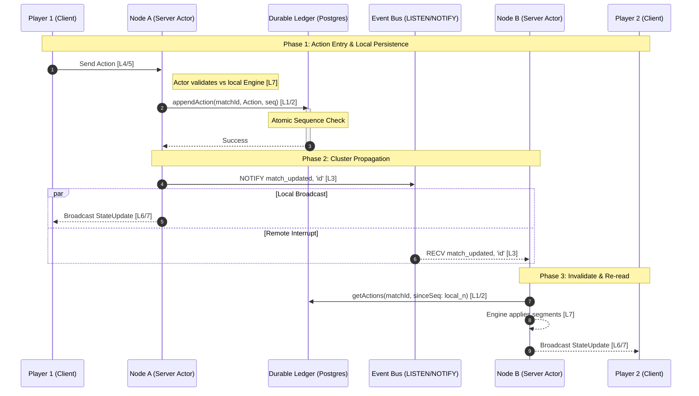

# Distributed Ledger Architecture

This document defines the architectural intent for the Phalanx: Duel distributed backend, following an OSI-layered abstraction model and a **Ledger-as-Authority** principle.

## 1. Core Philosophy: The Deterministic Ledger

The canonical source of truth for any match is the **Action Log** (Ledger). All game state is derived by evaluating the ordered sequence of inputs (Actions) against the initial configuration.

### 1.1 OSI-Layered Mapping

To ensure strict decoupling and a "pluggable" backend, the system is divided into seven layers:

| Layer | Component | Responsibility | PDU (Data Unit) |
| :--- | :--- | :--- | :--- |
| **7: Application** | **Game Engine** | Pure deterministic rules logic. | `GameState` |
| **6: Presentation** | **State Redactor** | Translating raw state into player-specific views. | `ServerMessage` |
| **5: Session** | **Match Supervisor** | Mapping local WebSockets to specific Match Actors. | `SessionID` |
| **4: Transport** | **WS / HTTP** | Ensuring reliable delivery of JSON segments. | `Segment` |
| **3: Network** | **Event Bus** | Cluster-wide signaling via `LISTEN/NOTIFY`. | `MatchID` |
| **2: Data Link** | **Ledger Store** | Atomic sequencing and append-only integrity. | `LedgerEntry` |
| **1: Physical** | **Postgres / Drizzle** | Durable storage of raw JSONB strings. | `Bits / JSONB` |

## 2. Information Flow

Information flows strictly down the stack for **Transmissions** (Saving Actions) and up the stack for **Receptions** (Syncing State).

### 2.1 Action Persistence (Down-Stack)
1.  **L7/L5**: Match Supervisor receives a player intent via WebSocket.
2.  **L7**: Game Engine validates the action against the local cached state.
3.  **L2**: Ledger Store executes an atomic append to the `match_actions` table.
4.  **L3**: Upon successful persistence, a `NOTIFY match_updated, '<match_id>'` is emitted.

### 2.2 Invalidate & Re-read Synchronization (Up-Stack)
1.  **L3**: Node B receives a `NOTIFY` interrupt containing a `match_id`.
2.  **L5**: The Supervisor identifies the local Actor for that match.
3.  **L2**: The Actor fetches new actions from the Ledger (`sinceSequence = local_n`).
4.  **L7**: The local Engine applies the new segments to the local state.
5.  **L6/L7**: The updated state is redacted and broadcast to local sockets.

## 3. Sequence Diagram

## 4. Implementation Guidelines

1.  **Atomic Sequencing**: Use Postgres unique constraints on `(match_id, sequence_number)` to enforce ledger integrity at Layer 1.
2.  **Stateless Notifications**: The `NOTIFY` payload must *only* contain the `MatchID`. Do not trust the network layer to carry game state.
3.  **No Layer Leaks**: The Data Link layer (DB Store) must not import or reference Sockets (Transport) or Match Instances (Session).
4.  **User-Defined Types (UDT)**: Pure database concerns (like action-type enums or specialized indexing) should be implemented in Postgres to isolate them from Layer 7.
