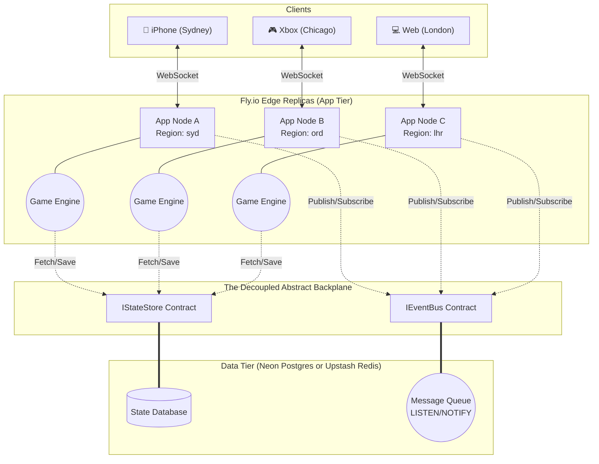

# Horizontal Scaling Architecture Proposal (Neon Postgres)

## 1. Problem Statement

Currently, the Phalanx Duel server runs single-instance with all active game states, websocket bindings, and matchmaking pools held entirely in-memory:
- `MatchManager` relies on `this.matches = new Map<string, MatchInstance>()`.
- Real-time communication routes by looking up local `socketMap` bindings.

In a horizontally scaled environment (e.g., Fly.io multi-region or multiple container instances behind a load balancer), Player A could connect to Node `App-1` while Player B connects to Node `App-2`.
Without shared state, `App-1` has no knowledge of the match, and gameplay is impossible.

## 2. Solution: The Postgres-Only Backplane (Neon)

By leveraging your existing **Neon Serverless Postgres** database, we can extract state and utilize native Postgres `LISTEN` / `NOTIFY` to achieve a horizontally scalable backplane without introducing any new infrastructure layers (like Redis).

### 2.1. Stateless Game Execution (Data Layer)
* **Match State persistence**: Move the active `Map<string, MatchInstance>` into a Postgres table (e.g. `active_matches` with a `JSONB` state column).
* **Concurrency Control**: When an action occurs, the Node pulls the state from Postgres (`SELECT ... FOR UPDATE` to lock the row), applies the rules engine `applyAction(...)`, and saves it back in a single transaction.

### 2.2. Distributed WebSocket Routing (Pub/Sub Layer)
* **The Listener Hub**: Every Node.js container establishes exactly **one** dedicated, non-pooled connection to the Neon database instance and issues a `LISTEN match_events` command. *(Note: This must be a direct connection, not through the PgBouncer `-pooler` endpoint, as `LISTEN` requires session-level persistence).*
* When Node 1 executes a successful game state transaction, it issues a `NOTIFY match_events, '{"matchId": "xyz", "action": "..."}'` command as part of that same pooled transaction.
* Node 2 receives the pub/sub event via its listener hub, looks into its *local* `socketMap`, and forwards the result natively if the target player is connected there.

### 2.3. Distributed Matchmaking
* The open lobby / matchmaking arrays move to a Postgres table (`matchmaking_queue`).
* Players looking for a match insert a row. A standard SQL query utilizing `SELECT ... FOR UPDATE SKIP LOCKED` can be used to atomically pull two matching players from the queue and generate a new Match row, simultaneously firing a `NOTIFY` to alert the connected Websockets.

## 3. Componentization (Architectural Firewalls)

To ensure operational resilience, the architecture must implement **Architectural Firewalls** between the application system (core mechanics, rules, ladder processing, bots) and the distributed backend (state storage, pub/sub transport). The Game Engine must be absolutely agnostic to whether it is running on a massive Kafka cluster or a single test node.

### 3.1. Interface Contracts
We establish severe boundaries via Dependency Injection using two primary interface domains:
* `IStateStore`: Defines the contract for fetching, locking, and persisting `GameState` payloads.
* `IEventBus`: Defines the contract for publishing and subscribing to match-level socket events.
The WebSocket gateway and Engine logic interact *exclusively* with these interfaces.

### 3.2. Concrete Implementations
1. **Local Mode (`InMemoryStateStore` / `EventEmitterBus`)**: Plugs into local memory limits. Designed for single-instance game operation, isolated development testing, staging, and localized AI matches.
2. **Distributed Mode (`PostgresStateStore` / `PostgresNotifyBus`)**: Implements the identical interfaces but leverages Postgres `SELECT ... FOR UPDATE` and `NOTIFY/LISTEN` to facilitate multi-node state synchronization. (Alternatively: `RedisStateStore` or `KafkaEventBus`).

### 3.3. Graceful Degradation
If the server loses its connection to the Distributed Backend ecosystem, the DI container hot-swaps the runtime back into **Local Mode**. Distributed matchmaking ceases, but the application instance remains fully operational: clients connected to the isolated node can seamlessly continue playing matches against the Bot engine, testing mechanics, or viewing the interface without taking the core servers down.

## 4. Testing Strategy (Architectural Validation)
Because the `IStateStore` and `IEventBus` interfaces completely decouple the application from the transport medium, the testing methodology shifts into granular, highly reliable phases:

### 4.1. Local Mode Testing (Fast & Deterministic)
* **Unit Tests (`vitest`)**: Execute 95% of state transition and engine validation test suites utilizing exclusively the `InMemoryStateStore` and `EventEmitterBus`. This executes in milliseconds and proves that the core game mechanics and rule adjudications work perfectly without any database I/O latency.
* **Mocks/Spies**: Inject mock versions of the `IEventBus` into the Engine controller to assert that structural events (`match_created`, `event_combat_step`) are correctly pushed to the bus exactly once upon state transitions.

### 4.2. Distributed Transport Testing (Integration)
* **Postgres Adapter Tests**: Boot a lightweight, ephemeral Postgres instance (e.g. Testcontainers or an isolated Neon branching script).
* **Multi-Instance Assertions**: Instantiate two separate instances of the `PostgresStateStore` and `PostgresNotifyBus` on different test processes. Have Instance A subscribe via `LISTEN`. Have Instance B execute a state transition. Expect Instance A to process the notification via `NOTIFY` payload synchronously.

### 4.3. End-to-End Cluster Simulation (Playwright/K6)
* Launch two distinct Node.js server processes (`App-1: 3001` and `App-2: 3002`) bound to the identical Neon `-pooler` connection string.
* Configure a Playwright script where Player A opens a WebSocket to `App-1` and Player B opens a WebSocket to `App-2`.
* Simulate a 12-turn game, verifying that Player A sees Player B's actions perfectly in real-time, proving the backend Pub/Sub layer routes WS frames across the container divide.

### 4.4. Chaos Testing (Graceful Degradation)
* **Failure Injection**: Boot the distributed server and explicitly sever the `DATABASE_URL` runtime environment var mid-session.
* **Assertion**: Verify the DI container gracefully catches the Postgres socket exception, swaps the active instances to `InMemoryStateStore`, and ensures that a client connected to the isolated node can immediately start a local Bot match without the Node process crashing or returning an unhandled 500 error.

## 5. Phase 2: Global Edge Architecture (Cross-Platform / Multi-Region)
When Phalanx Duel matures into massive coordinated play across Xbox and Mobile devices globally, the application tier will likely split into Edge Nodes (e.g. Fly.io `syd` node serving an iPhone in Australia, and an `ord` node serving an Xbox in Chicago).

**The Challenge with Postgres on the Edge**
While the `PostgresStateStore` and `PostgresNotifyBus` implementations are perfect for a single-region deployment, deploying them across oceanic distance introduces 200ms+ latency on state updates and pub-sub notifications because all nodes must write to the Primary Postgres database physically located in one region.

**The Interface Payoff**
Because of the **Architectural Firewalls** described in Section 3, achieving a Global Edge Architecture requires **zero changes to the Game Engine or rules systems**.

Instead, a new Strategy implementation is created and injected:
1. **Global Cache (`UpstashRedisStateStore`)**: A serverless, globally replicated Redis datastore provides millisecond read/write access to state from any geographic edge.
2. **Global Event Broker (`NatsEventBus` or `RedisEventBus`)**: A distributed messaging cluster (like NATS JetStream or Google Cloud Pub/Sub) routes the Websocket payloads across oceanic backbones securely and instantly.

The Mobile Edge Server in Australia and the Xbox Edge Server in Chicago simply boot with `DISTRIBUTED_MODE=global_redis`. They communicate effortlessly across the shared backplane, while the core Phalanx Duel engine processes the rules completely unaware of the oceanic distance.

## 6. Operational Considerations
- **Simplicity vs Scale**: A Postgres-only architecture drastically reduces operational overhead (no Redis to monitor, patch, or pay for).
- **Scale-to-Zero Constraints**: Because the `LISTEN` channels require persistent, open connections, your Neon compute endpoint will **not** scale back to zero while your Fly.io Node instances are running. If you want Neon to sleep, the Nodes must gracefully drop their Listeners when no players are online.

---

## Appendix A: Architecture Diagrams

### 1. The Single-Node Trap (Current State)
*If you vertically scale a single Node.js container with 4 PM2 threads, the memory is isolated. Player A and Player B cannot play against each other unless they randomly hit the exact same thread.*

```mermaid
graph TD
    ClientA["📱 Player A"] --> LB["⚖️ Load Balancer / Fly Edge"]
    ClientB["🎮 Player B"] --> LB
    
    subgraph "Vertically Scaled Server (Fly.io Machine)"
        Node1["Node Thread 1<br/>(In-Memory Map)"]
        Node2["Node Thread 2<br/>(In-Memory Map)"]
        Node3["Node Thread 3<br/>(In-Memory Map)"]
    end
    
    LB --> Node1
    LB --> Node2
    LB -.-> Node3
    
    style Node1 fill:#354f63,stroke:#b0c4d4
    style Node2 fill:#e85252,stroke:#b0c4d4,color:#fff
    style Node3 fill:#354f63,stroke:#b0c4d4
    
    note["Player A and Player B are stuck on different threads.<br/>The game breaks."] -.-> Node2
```

### 2. The Global Edge Architecture (Target State)
*The Phalanx Duel engine sits behind structural firewalls. Operations hit the distributed backplane, allowing real-time websocket pushes to cross geographic or container borders instantaneously.*

## 6. How to Validate This Locally (The `cluster` Env)
To emulate the Fly.io distributed production topology on a single developer laptop, we can introduce a new Docker Compose profile (e.g. `docker-compose.cluster.yml`).
1. **The Infrastructure**: The config provisions 1x `postgres` container, 1x `haproxy` (or `nginx`) container configured for round-robin balancing, and 3x replica `api-server` Node.js containers.
2. **The Execution**: You boot the cluster (`docker compose -f docker-compose.cluster.yml up --scale api-server=3`).
3. **The Simulation**: You launch 5 browser tabs pointing to `localhost:8080` (the HAProxy load balancer). HAProxy natively scatters the 5 WebSocket requests across the 3 randomly assigned API containers.
4. **The Validation**: Because the clients are hard-pinned to different Node instances, any successful matchmaking or game interaction between them definitively proves that the Postgres Pub/Sub backplane successfully synchronized the memory across the container boundaries.

## 7. The Alternative: Vertical Scaling ("Just Create a Bigger Box")
You raise the ultimate engineering counter-proposition: Why not just scale vertically?

**The Reality of Node.js**
Node.js is inherently single-threaded. If you buy a massive 16-Core, 64GB RAM machine on Fly.io, your `phalanxduel-server` process will still only utilize **1 CPU Core and ~1.4GB of RAM (the V8 heap limit)**.
- *Turn-based games are highly efficient*: A single Node.js thread can easily process thousands of concurrent matches depending on state complexity. It is extremely viable that your pre-alpha launch functions brilliantly on a single shared-cpu machine.
- *Breaking the Single-Thread ceiling*: To utilize the 15 other idle cores on that big machine, you must run a process manager (like `PM2` in cluster mode) to fork 16 identical Node.js execution threads.
- **The Catch**: Those 16 threads do **not** share memory. Even on the same vertical box, Thread 1 cannot read Thread 2's `MatchManager` Map. Thus, *you are immediately forced to build the exact same Pub/Sub architecture described above* to synchronize state between the local PM2 threads.

**Conclusion**
Vertical scaling defers the problem rather than solving it. A single instance will easily support a modest Beta, but as soon as the event loop experiences blocking lag (or you need to use more than 1 CPU core), this Interface-driven Postgres Component architecture remains identically required, whether you branch across vertical cores or horizontal Fly.io geographic zones.
