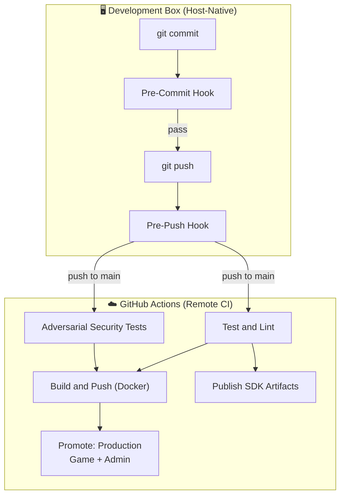

# Delivery Pipeline

> The pipeline starts on the development box and ends in production.
> Every stage is a quality gate. No stage may be bypassed.

## Pipeline Overview



---

## Stage 1: Pre-Commit Hook (Development Box)

**Trigger:** `git commit`
**Purpose:** Fast feedback on staged files. Catches secrets, formatting, and
lint errors before they enter the commit history.

| Check | Tool | What It Validates |
|---|---|---|
| Secret scanning | `secretlint` | No API keys, tokens, or credentials in staged files |
| Code lint + fix | `eslint --fix` | TypeScript/JavaScript code quality (auto-fixes) |
| Code formatting | `prettier --write` | Consistent formatting (auto-fixes) |
| Markdown lint | `markdownlint-cli2 --fix` | Documentation standards |
| Workflow lint | `actionlint` | GitHub Actions YAML correctness |
| Shell syntax | `bash -n` / `zsh -n` | Shell script parse errors |
| TOML formatting | `taplo fmt` | TOML file formatting |
| Package sort | `sort-package-json` | Canonical package.json key order |
| Env file guard | grep + exit 1 | Rejects `.env.local` and secret-bearing files |

After lint-staged, the hook runs **`verify:quick`** which executes:

| Phase | What Runs |
|---|---|
| 0: Build Identity | `infra:metadata` + `pnpm build` (full workspace) |
| 1: Linting | `eslint` + `shellcheck` + `actionlint` (if available) |
| 2: Type Checking | `tsc --noEmit` across all workspace packages |
| 5: Docs & Formatting | `docs:check` + `lint:md` + `prettier --check` |

> [!NOTE]
> `verify:quick` skips unit tests and QA verification for speed.
> Full testing is deferred to the pre-push hook.

---

## Stage 2: Pre-Push Hook (Development Box)

**Trigger:** `git push`
**Purpose:** CI-shaped verification before code leaves the development box.

Runs **`verify:ci`**. Before a release push, operators additionally run the
containerized **`rtk bin/dock pnpm verify:full`** gate required by `AGENTS.md`.

| Phase | What Runs |
|---|---|
| 0: Build Identity | Already generated by the pre-commit `verify:quick` gate |
| 1: Linting | `eslint` + `shellcheck` + `actionlint` (if available) |
| 2: Type Checking | `tsc --noEmit` across all workspace packages |
| 3: Testing | `pnpm test:coverage:run` (all covered unit/integration suites) |
| 4: Tooling & QA | Go client, schema, rules, boundaries, contracts, property, performance, replay, playthrough, and visual checks |
| 5: Docs & Formatting | `docs:check` + `lint:md` + `prettier --check` |

The release-only container gate adds full workspace tests and mutation testing
through `verify:full`.

> [!IMPORTANT]
> `actionlint` and `shellcheck` are **dev-box tools**. They run when
> installed locally (via brew) but skip gracefully in CI. The pre-commit
> and pre-push hooks are the authoritative gates for these tools.

---

## Stage 3: Test and Lint (Remote CI)

**Trigger:** Push to `main` (or PR against `main`)
**Purpose:** Integration verification in a clean, reproducible environment.
Confirms that what passed locally also passes from a clean checkout.

```yaml
# pipeline.yml → test job
corepack pnpm build
corepack pnpm verify:ci
```

**`verify:ci`** executes:

| Phase | What Runs |
|---|---|
| 1: Linting | `eslint` (auxiliary tools skip — gated locally) |
| 2: Type Checking | `tsc --noEmit` across all workspace packages |
| 3: Testing | `pnpm test:coverage:run` (with coverage reporting) |
| 4: Tooling & QA | Replay verification + playthrough matrix/anomaly verification |
| 5: Docs & Formatting | `docs:check` + `lint:md` + `prettier --check` |

**Artifacts uploaded:** Coverage reports (always), gameplay trust-gate
artifacts (on failure). The test job also writes a GitHub step summary naming
the coverage, replay, playthrough anomaly, and adversarial authority gates.

> [!NOTE]
> CI runs `test:coverage:run` instead of `test:run:all` to produce
> coverage artifacts. The test suites are the same.

### Smoke Checks vs Fairness Truth Gates

Smoke checks answer "does this surface still basically run?" Use commands such
as `pnpm verify:quick`, `pnpm qa:playthrough`, or headed
`pnpm qa:playthrough:ui` for fast local feedback and visual diagnostics.

Fairness truth gates answer "can this build be trusted for gameplay?" Protected
CI must run coverage reporting, replay verification, playthrough anomaly
verification with warnings failing, and adversarial server-authority rejection
coverage. Locally, use `pnpm verify:ci` for the CI-shaped lane or
`pnpm verify:full` for the broader pre-push gate.

### Integration Environment (Postgres)

The `test` job includes a **Postgres 17 service container**. This ensures that
integration tests (matchmaking, WebSocket, etc.) run against a real database
with the canonical schema.

- **Setup:** Database is initialized via `pnpm --filter @phalanxduel/server db:migrate`
- **Identity:** Tests use a trusted connection to `postgresql://postgres@localhost:5432/phalanxduel_test`

### Test Parallelism

To maintain absolute stability and prevent database state interference:
- **Server Tests:** Run sequentially (`fileParallelism: false`).
- **Engine/Shared Tests:** Run in parallel (no database dependencies).

---

## Stage 4: Adversarial Security Tests (Remote CI)

**Trigger:** Push to `main` (or PR against `main`) — runs in parallel with Test and Lint
**Purpose:** Server-authority validation. Confirms that the server correctly
rejects malformed, out-of-turn, and privilege-escalation attempts.

```yaml
# pipeline.yml → adversarial job
corepack pnpm build
corepack pnpm --filter @phalanxduel/server test:adversarial
```

> [!NOTE]
> This job is **independent** from `verify:ci` but it is still protected:
> deployment build/push waits on both `test` and `adversarial`. It validates
> security invariants in parallel with the main test suite.

---

## Stage 5: Publish SDK Artifacts (Remote CI)

**Trigger:** After Test and Lint passes
**Purpose:** Generate and publish Go and TypeScript SDK artifacts from the
authoritative OpenAPI and AsyncAPI specifications.

```yaml
# pipeline.yml → publish-sdks job (needs: test)
corepack pnpm build
corepack pnpm openapi:gen
corepack pnpm sdk:gen
```

**Artifacts uploaded:** `sdk-go`, `sdk-ts`

> [!NOTE]
> SDK generation requires Java (for `openapi-generator-cli`) and Go.
> This is the only place in CI where SDK generation runs.

---

## Stage 6: Build and Push Docker Image (Remote CI)

**Trigger:** After Test and Lint passes, only on `main` branch pushes
**Purpose:** Build the production Docker image and push to GHCR.

- Uses Docker Buildx with GHA cache
- Tags: `sha-<full-sha>` + `latest-main`
- Outputs `image_ref` (digest-pinned) for downstream deployment stages

---

## Stage 7: Promote to Production (Remote CI)

**Trigger:** After Build and Push completes, only on `main` branch pushes
**Purpose:** Deploy the tested image to both required production services.
Requires manual approval via GitHub Environment protection rules.

- **Game target:** `phalanxduel-production` with `fly.production.toml`
- **Admin target:** `phalanxduel-admin` with `admin/fly.toml`
- **URLs:** `https://play.phalanxduel.com` and
  `https://phalanxduel-admin.fly.dev`
- Pulls the Stage 6 `repository@sha256:digest` once, tags it locally for both
  Fly apps, and deploys without rebuilding source
- The release is green only when both deployments and both services' health
  checks succeed

Staging is retired. It is not a release dependency or a deployment target.

---

## Tool Responsibility Matrix

| Tool | Pre-Commit | Pre-Push | CI Test | CI Adversarial | CI SDK |
|---|:---:|:---:|:---:|:---:|:---:|
| `secretlint` | ✅ | — | — | — | — |
| `eslint` | ✅ (fix) | ✅ (check) | ✅ (check) | — | — |
| `prettier` | ✅ (fix) | ✅ (check) | ✅ (check) | — | — |
| `actionlint` | ✅ | ✅ | ⏭️ skip | — | — |
| `shellcheck` | — | ✅ | ⏭️ skip | — | — |
| `markdownlint` | ✅ (fix) | ✅ (check) | ✅ (check) | — | — |
| `tsc --noEmit` | ✅ | ✅ | ✅ | — | — |
| Unit tests | — | ✅ | ✅ (coverage) | — | — |
| Adversarial tests | — | — | — | ✅ | — |
| Schema verification | — | ✅ | — | — | — |
| FSM consistency | — | ✅ | — | — | — |
| Event log verification | — | ✅ | — | — | — |
| Feature flag env | — | ✅ | — | — | — |
| Go clients check | — | ✅ | — | — | — |
| Replay verification | — | ✅ | ✅ | — | — |
| Playthrough verification | — | ✅ | ✅ | — | — |
| Docs artifact check | ✅ | ✅ | ✅ | — | — |
| OpenAPI + SDK gen | — | — | — | — | ✅ |
| Docker build | — | — | — | — | — |

---

## Verification Mode Reference

The `scripts/ci/verify.sh` script accepts a mode argument that controls which
phases run:

| Mode | Used By | Build | Lint | Typecheck | Tests | QA/Schema | Docs |
|---|---|:---:|:---:|:---:|:---:|:---:|:---:|
| `quick` | Pre-commit | ✅ | ✅ | ✅ | — | — | ✅ |
| `full` | Pre-push | ✅¹ | ✅ | ✅ | ✅ | ✅ | ✅ |
| `ci` | GHA test job | —² | ✅ | ✅ | ✅ (+coverage) | ✅ (replay, playthrough) | ✅ |
| `release` | Deploy script | — | — | — | — | ✅ (fairness, API integration) | — |

¹ `full` mode only runs `infra:metadata` (build happens in pre-commit's `quick`).
² CI mode skips build because pipeline.yml runs `pnpm build` explicitly before `verify:ci`.
